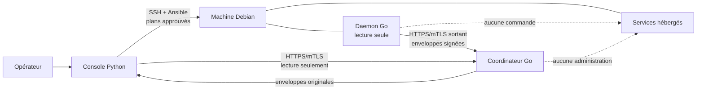
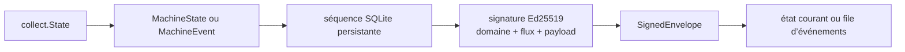
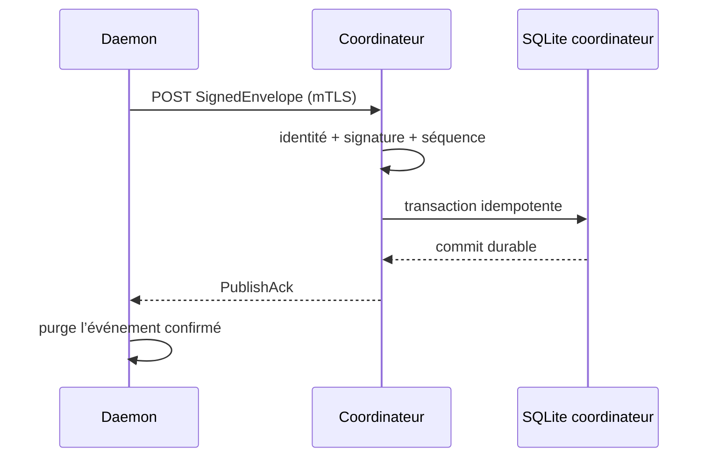

# Anatomie du projet

> État décrit : P1 à P4, prouvés dans le LAB `quick` le 2026-07-12. P5 est
> indiqué comme futur lorsqu’il aide à comprendre une frontière, jamais comme
> une capacité déjà livrée.

Ce guide explique le chemin réellement suivi par les données et les autorités.
Les [ADR](adr/REGISTRE.md) et les [spécifications](specifications/README.md)
restent normatifs ; cette page sert de carte de lecture pour le code.

Une [édition HTML autonome et interactive](anatomie-du-projet.html) permet de
faire ressortir successivement les flux d'installation, de publication, de
lecture et de reprise.

## La chaîne en une minute

Deux chemins ne se confondent jamais :

- **administrer** : console → SSH/Ansible → machine, après un plan approuvé ;
- **observer** : daemon → coordinateur → console, sans commande distante.

Le daemon et le coordinateur peuvent disparaître sans arrêter les services déjà
hébergés. La console reste la seule autorité d’administration.

## 1. Déclarer et auditer sans modifier

La console part d’une déclaration JSON versionnée. Une machine y possède un
identifiant logique, une adresse, un port SSH, un utilisateur bootstrap et une
clé dédiée. L’adresse permet de joindre la cible ; elle ne prouve jamais son
identité.

Avant l’audit, la console observe la clé d’hôte Ed25519 :

1. elle la compare à l’empreinte fournisseur, ou demande un TOFU visible ;
2. elle la conserve dans son propre registre et rend un `known_hosts` privé ;
3. toute différence ultérieure devient un refus explicite.

L’audit exécute ensuite un script read-only par SSH. Il relève Debian,
l’architecture, systemd, l’espace libre, l’horloge, les autorités de
configuration et les sockets. Sa sortie NUL-delimited évite les ambiguïtés de
parsing. Aucun fichier distant n’est modifié.

**Entrée :** déclaration + clé SSH bootstrap + preuve de clé d’hôte.
**Sortie :** décision `eligible` ou refus/conflits/limites expliqués.
**Code :** [`model.py`](../console/src/your_cloud_console/model.py),
[`ssh.py`](../console/src/your_cloud_console/ssh.py),
[`audit.py`](../console/src/your_cloud_console/audit.py).

## 2. Préparer l’administration et la récupération

La première mutation crée un compte `your-cloud-admin` non-root et une clé
Ed25519 propre à la machine. La clé privée reste chiffrée dans l’état local de
la console. Un kit de récupération est créé et rouvert avant de considérer la
clé utilisable.

La console conserve le chemin bootstrap pendant l’opération, puis prouve dans
une **nouvelle** session :

- l’authentification du compte dédié ;
- `sudo -n` vers root ;
- la cohérence entre clé chiffrée et kit de récupération.

Le kit passe au schéma 2 lorsque P4 ajoute l’autorité privée mTLS, toujours
chiffrée. Aucun secret clair durable n’entre dans la déclaration ou le dépôt.

**Entrée :** audit éligible + mot de passe privé + approbation du plan.
**Sortie :** compte dédié, clé chiffrée et kit vérifié.
**Code :** [`secrets.py`](../console/src/your_cloud_console/secrets.py),
[`security.py`](../console/src/your_cloud_console/security.py).

## 3. Déposer et enrôler le daemon

La console ne télécommande jamais un daemon. Elle utilise le chemin
d’administration pour exécuter le playbook d’enrôlement :

1. `--syntax-check` doit réussir dans le LAB ;
2. Ansible crée le compte système `your-cloud-observer`, `nologin`, sans sudo ;
3. le binaire Go et l’unité systemd durcie sont copiés ;
4. le daemon crée localement son identité Ed25519 et sa base SQLite ;
5. la console lit uniquement la clé publique et un premier état ;
6. elle approuve l’identité, puis revérifie la signature de cet état.

La clé privée du daemon ne quitte jamais la machine. L’enrôlement n’affecte
aucune infrastructure et n’applique aucun rôle de service.

**Entrée :** binaire construit, machine éligible et plan approuvé.
**Sortie :** daemon actif, identité publique approuvée, premier état signé.
**Code :** [`enrollment.py`](../console/src/your_cloud_console/enrollment.py),
[`enroll-observer.yml`](../engine/ansible/enroll-observer.yml).

## 4. Collecter, séquencer et signer localement

Au démarrage puis toutes les 60 secondes, le daemon collecte seulement la
télémétrie V1 : système, charge, mémoire, disque racine, reboot de sécurité et
unités systemd choisies.

Il entretient deux séquences persistantes indépendantes :

- `state` : l’état périodique remplace l’état courant dans SQLite ;
- `event` : un changement significatif alimente une file bornée.

Chaque payload Protobuf est signé sur les octets exacts : domaine
`your-cloud.telemetry.v1`, octet du flux, puis payload. Le daemon place la clé
publique choisie, le flux, le payload et la signature dans `SignedEnvelope`.
Un débordement d’événements produit un événement `telemetry-gap` explicite.

**Dépendances :** Go 1.24, runtime Protobuf, SQLite embarqué, systemd et fichiers
système read-only.
**Code :** [`app.go`](../daemon/internal/app/app.go),
[`store.go`](../daemon/internal/store/store.go),
[`identity.go`](../daemon/internal/identity/identity.go).

## 5. Sécuriser la machine par un plan séparé

La présence du daemon n’autorise aucune sécurisation automatique. La console
présente un second plan, conserve une session SSH de secours et prépare un
rollback dédié.

Le profil possède explicitement ses fichiers SSH, nftables, sysctl et sudoers.
Il configure SSH key-only, bloque root en nouvelle connexion, borne le pare-feu
en IPv4 et IPv6 et refuse toute dérive au lieu de la réparer silencieusement.
Une nouvelle connexion IPv4, une nouvelle connexion IPv6 et sudo sont prouvés
avant de relâcher le filet de récupération.

**Entrée :** accès dédié prouvé + réseaux d’administration + accès hors bande.
**Sortie :** profil possédé, manifeste, rollback et re-run `changed=0`.
**Code :** [`security.py`](../console/src/your_cloud_console/security.py),
[`apply-linux-profile.yml`](../engine/ansible/apply-linux-profile.yml).

## 6. Installer le coordinateur et le mTLS

P4 installe le coordinateur uniquement sur une machine déjà auditée, enrôlée et
sécurisée. En mode local, il peut cohabiter avec le daemon, mais pas partager
son identité ou son stockage.

La console crée une autorité X.509 Ed25519 et trois rôles distincts :

| Rôle du certificat | Utilisation autorisée |
|---|---|
| `daemon:<machine>` | publier la télémétrie de cette machine |
| `coordinator:<machine>` | prouver le serveur joint par IP ou DNS |
| `console:<identité>` | lire les états et événements |

L’autorité privée reste chiffrée dans la console et le kit de récupération. Le
coordinateur reçoit son certificat, sa clé de service, le certificat public de
l’autorité et une copie dérivée des identités de machines actives.

Ansible crée `your-cloud-coordinator`, ses répertoires privés, une SQLite bornée
à 64 Mio et une unité systemd distincte. Le pare-feu doit déjà autoriser le port
local choisi ; le playbook refuse sinon de poursuivre.

**Code :** [`transport.py`](../console/src/your_cloud_console/transport.py),
[`coordination.py`](../console/src/your_cloud_console/coordination.py),
[`install-local-coordinator.yml`](../engine/ansible/install-local-coordinator.yml).

## 7. Publier et accuser durablement

Le daemon ouvre une connexion HTTPS/mTLS **sortante**. Il ne possède toujours
aucun port entrant. Après une coupure, il publie dans cet ordre :

1. l’état courant, afin de rendre la machine immédiatement lisible ;
2. les événements qui subsistent dans la file locale.

La route `POST /v1/telemetry/{machine}` exige que le certificat client porte le
rôle de cette même machine. Le coordinateur vérifie ensuite le registre public,
la signature Ed25519 et la cohérence du payload.

La transaction SQLite est validée avant l’émission de `PublishAck`. Une
retransmission identique est idempotente. Le daemon ne purge un événement local
qu’après un accusé mTLS dont machine, flux et séquence correspondent.

En cas d’échec, le daemon conserve ses données et réessaie avec une temporisation
exponentielle bornée et une part aléatoire.

## 8. Lire puis revérifier dans la console

La console joint le coordinateur avec `console:local` :

- `GET /v1/state/{machine}` retourne la dernière enveloppe originale ;
- `GET /v1/events/{machine}?after=&limit=` retourne `EnvelopePage`.

Le coordinateur protège le transport, mais il n’est pas l’autorité finale sur
la provenance. La console vérifie à nouveau : identité active, clé attendue,
signature Ed25519, machine contenue, flux, valeurs bornées et séquence non
rejouée. Le JSON affiché n’est produit qu’après cette validation.

`PublishAck` et `EnvelopePage` structurent le transport ; seul le payload de
`SignedEnvelope` porte la signature de la machine.

**Code :** [`server.go`](../coordinateur/internal/server/server.go),
[`telemetry.py`](../console/src/your_cloud_console/telemetry.py).

## 9. Comprendre les pannes

| Événement | Ce qui continue | Ce qui est retardé | Reprise |
|---|---|---|---|
| Console éteinte | daemon, coordinateur, services | lecture et nouveaux plans | la console retrouve état et journal |
| Coordinateur arrêté | collecte locale, services, SSH | télémétrie centralisée | état courant puis événements sont republiés |
| Réseau coupé | collecte et file locale | publications et lectures | backoff puis retransmission idempotente |
| Daemon arrêté | services et administration SSH | nouveaux états | collecte immédiate au redémarrage |
| Base coordinateur perdue | autorités, déclarations, services | historique dérivé | les daemons republient leur état courant |

Une absence de données n’est jamais transformée automatiquement en diagnostic
de panne d’un service.

## Matrice des composants

| Composant | Processus et dépendances | Données détenues | Réseau | Autorité et limites |
|---|---|---|---|---|
| Console | Python 3.13, OpenSSH, Ansible, cryptography, Protobuf | déclaration, clés d’hôte, clés admin chiffrées, CA mTLS chiffrée, registre public | socket Unix local, SSH sortant, HTTPS/mTLS sortant | décide et administre ; ne reçoit pas la télémétrie directement |
| Engine | playbooks invoqués par la console | aucun état autonome | utilise le SSH de la console | applique seulement un plan approuvé ; daemon et coordinateur ne peuvent pas l’appeler |
| Daemon | binaire Go, systemd, SQLite, Protobuf | clé Ed25519 machine, état courant, événements non confirmés | HTTPS/mTLS sortant, aucun port entrant | observe sa machine ; aucune commande, aucun sudo, aucun secret de flotte |
| Coordinateur | binaire Go, systemd, SQLite, TLS 1.3 | enveloppes originales, dernier état, 30 jours d’événements, registre public dérivé | écoute HTTPS/mTLS sur une adresse explicite | conserve et sert ; aucune clé SSH, aucun enrôlement, aucune révocation |
| Services | processus propres à la machine | leurs données applicatives | selon leur propre exposition | ne dépendent pas du pilotage pour continuer à fonctionner |

## Correspondance entre les couches

| Fonction visible | Contrat | Transport | Preuve de sécurité | Persistance |
|---|---|---|---|---|
| Premier contact | déclaration JSON + audit borné | SSH | clé d’hôte épinglée | registre console |
| Machine observable | `MachineState`, `MachineEvent`, `SignedEnvelope` | inspection SSH ponctuelle | signature Ed25519 machine | SQLite daemon + registre console |
| Mutation sûre | plan et récapitulatif Ansible | SSH direct | nouvelle session, sudo, rollback | manifeste du profil + secrets chiffrés |
| Observation continue | `PublishAck`, `EnvelopePage` | HTTPS/mTLS | rôles X.509 puis seconde vérification Ed25519 | SQLite daemon et coordinateur |

## Ce qui change à P5

P1 à P4 prouvent un coordinateur local colocalisé. P5 devra reprendre le même
binaire et le même protocole sur un point distant, puis prouver NAT, exposition
publique bornée, migration progressive et plusieurs infrastructures. Il ne doit
ajouter ni commande au daemon, ni entrée de télémétrie vers les LAN privés.

Pour la direction produit, lire le [Guide du bâtisseur](GUIDE-DU-BATISSEUR.md).
Pour les preuves exécutées, lire la [documentation du LAB](lab/README.md).
