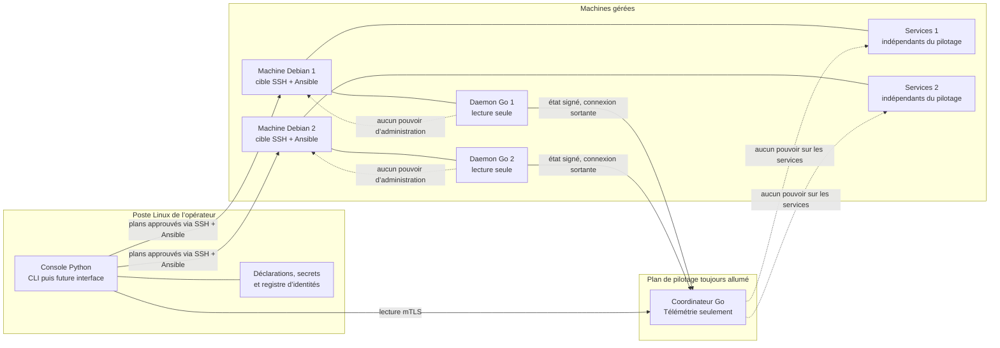
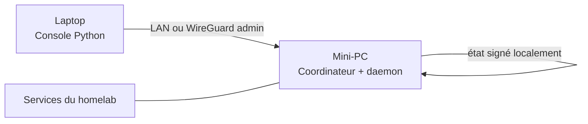
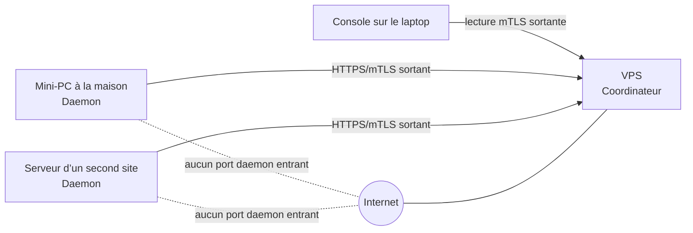
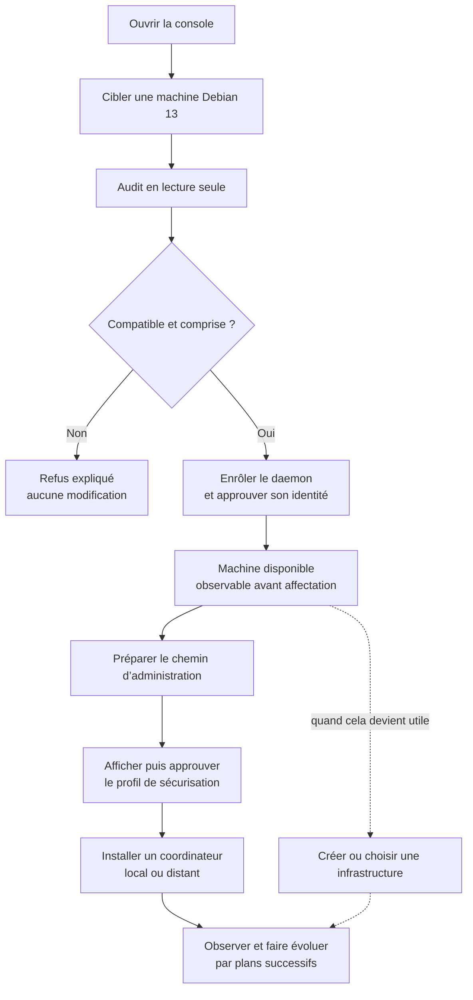

# Guide du bâtisseur

> État : architecture cible en cours de cadrage. Ce guide décrit le produit que nous construisons ; il ne prétend pas que ces fonctions sont déjà implémentées.

Une [édition HTML autonome et illustrée](guide-du-batisseur.html) facilite la lecture d’ensemble. Ce fichier Markdown reste la source éditoriale de référence.

## La promesse

Le projet doit permettre à une personne de commencer avec un seul serveur Linux, puis de faire grandir son installation vers plusieurs machines, plusieurs sites et plusieurs infrastructures sans changer d’outil ni rendre ses services dépendants du pilotage.

Le débutant reçoit un parcours guidé et des choix sûrs. L’utilisateur expérimenté retrouve les mêmes concepts dans la CLI, la déclaration lisible et les preuves détaillées. Git reste facultatif, les composants centraux restent légers et aucune plateforme cloud n’est imposée.

La promesse de sécurité n’est pas « personne ne sera jamais compromis ». Elle est plus honnête : une compromission doit rester confinée, les autorités doivent être séparées et le produit ne doit jamais transformer une machine exposée en passerelle d’administration vers toute l’infrastructure.

## L’architecture en une image

Il existe deux chemins distincts.

Le chemin d’observation part des machines. Chaque daemon envoie un état minimal signé vers le coordinateur. La console vient ensuite lire ces données lorsqu’elle est ouverte.

Le chemin d’administration part de la console. Lorsqu’un changement est demandé, elle affiche un plan, attend l’approbation de l’opérateur puis atteint directement la machine par SSH et Ansible. Ni le daemon ni le coordinateur ne peuvent exécuter ce changement en V1.

## Les trois pièces du produit

### La console

La console est l’outil utilisé par l’opérateur. La V1 commence par une CLI Linux ; une interface graphique pourra plus tard utiliser la même API locale.

Elle possède les déclarations d’infrastructure, les clés d’administration, les références de secrets et le registre public des identités de machines. Ces données ne sont jamais confiées au coordinateur. L’API locale reste sur un socket Unix et n’ouvre pas une porte d’entrée sur le LAN.

### Le daemon d’observation

Chaque machine Debian gérée reçoit un daemon Go natif, léger et sans port entrant. Il observe uniquement un état borné : système, charge, mémoire, espace disque, besoin de redémarrage de sécurité et unités systemd choisies.

Il possède une identité propre à la machine. Sa clé privée ne quitte jamais l’hôte. Il ne possède aucun secret de flotte, ne modifie pas le système et ne commande jamais une autre machine.

### Le coordinateur

Le coordinateur Go conserve la télémétrie lorsque la console est éteinte. Il peut vivre sur un mini-PC du LAN ou sur un VPS. Une petite installation peut le colocaliser avec un autre rôle, mais ses comptes, clés, données et limites de ressources restent séparés.

Il ne détient ni clé SSH, ni clé WireGuard d’administration, ni secret applicatif. Sa compromission peut retarder ou exposer la télémétrie conservée ; elle ne doit pas donner accès à l’administration de l’infrastructure.

## Trois manières de commencer

### Inspection ponctuelle

L’utilisateur possède une machine et son laptop, mais aucun hôte toujours allumé pour le pilotage. La console peut auditer et interroger la machine au travers du chemin d’administration. Lorsque le laptop est éteint, aucune observation continue n’est promise.

### Mode local

Le même composant coordinateur fonctionne dans le LAN sans exposition publique. Son profil de déploiement diffère du serveur public borné utilisé à distance. Sur un homelab à une seule machine, il peut cohabiter avec le daemon. L’historique continue d’être collecté lorsque le laptop est éteint.

### Mode distant ou hybride

Le VPS fournit un point de rendez-vous accessible aux différents sites. Un domaine est pratique mais facultatif : une adresse IP suffit, car la confiance vient des identités cryptographiques et non du DNS.

Ce trafic de télémétrie ne remplace pas WireGuard. Les tunnels d’administration et d’exposition conservent leurs propres rôles, séparés l’un de l’autre et installés uniquement lorsque la topologie en a besoin.

## Le parcours d’un utilisateur V1

### 1. Premier contact

L’utilisateur indique une adresse et choisit une clé SSH existante uniquement pour le bootstrap. La console enregistre la première clé d’hôte présentée lorsque le fournisseur ne fournit pas d’empreinte, puis refuse toute différence ultérieure.

L’audit reste en lecture seule. Il vérifie la cible Debian 13 amd64, SSH, `sudo`, l’espace disque, l’horloge, les autorités de configuration concurrentes et les ports qui seraient affectés. Une machine inconnue ou complexe reçoit un refus expliqué plutôt qu’une modification hasardeuse.

### 2. Enrôlement

Le daemon est installé sous son propre compte et crée localement son identité. La machine devient observable et reste d’abord disponible, sans infrastructure obligatoire et sans rôle appliqué automatiquement.

Une machine appartient ensuite à zéro ou une seule infrastructure. Son affectation est indépendante de la sécurisation et de l’observation : elle peut intervenir dès l’enrôlement ou plus tard. La machine peut ensuite sortir d’une infrastructure et en rejoindre une autre sans être réenrôlée.

### 3. Chemin d’administration et sécurisation

Le parcours prépare un compte non-root distinct avec une clé propre à la machine. Il ne pollue pas le répertoire `~/.ssh` personnel de l’utilisateur.

Le profil de sécurisation forme un second plan. Il configure un pare-feu hôte dual-stack, rend SSH key-only, interdit la connexion directe de root et ne reprend que des réglages `sysctl` justifiés. Les accès qu’il ne possède pas restent visibles au lieu d’être supprimés silencieusement.

Avant de fermer le dernier accès de bootstrap, les secrets nécessaires sont chiffrés dans la console et un kit de récupération est exporté. Les changements SSH et pare-feu conservent la session courante, testent une connexion réellement distincte et s’appuient en dernier recours sur l’accès hors bande de l’opérateur.

### 4. Observation continue

L’utilisateur choisit un coordinateur local ou distant. Le produit installe exactement le même composant dans les deux cas. Les daemons envoient des messages signés par HTTPS/mTLS ; le coordinateur conserve le dernier état et un journal borné.

Si le coordinateur tombe, cette panne ne provoque pas l’arrêt des services déjà déployés. Les daemons gardent localement les événements importants puis republient d’abord leur état actuel au retour du pilotage.

### 5. Évolution

Un nouveau coordinateur ou une mise à jour commence sur une machine pilote. L’ancien chemin reste disponible jusqu’à ce que plusieurs échanges valides aient prouvé le nouveau. Le premier échec arrête le déploiement.

La dérive n’est jamais corrigée silencieusement. La console la montre, vérifie que le produit possède encore la politique concernée puis propose un nouveau plan. Un autre outil qui revendique la même autorité provoque un refus.

## Ce que la sécurité interdit

| Composant compromis | Ce que l’attaquant peut affecter | Ce qu’il ne doit pas obtenir |
|---|---|---|
| Processus daemon compromis | La disponibilité et la sincérité de la télémétrie de cette machine, dans la limite des droits du compte daemon | Les services hors de ses permissions, l’identité d’une autre machine, les clés SSH de la console, une commande sur la flotte |
| Machine gérée compromise | Son système, ses services locaux et l’usage de sa propre identité tant qu’elle n’est pas révoquée | L’identité d’une autre machine, les clés SSH de la console, une commande sur la flotte |
| Coordinateur | Disponibilité et confidentialité de la télémétrie conservée | Secrets d’infrastructure, accès SSH, déchiffrement des secrets, autorisation de nouvelles identités |
| Identité de lecture de console | Consultation de la télémétrie autorisée | Modification du coordinateur, enrôlement, administration des machines |
| Console de l’opérateur | Autorités d’administration détenues par cette console | La sécurité dépend alors de la récupération, du chiffrement local et du poste de confiance de l’opérateur |

Une machine réellement compromise peut utiliser sa propre clé tant qu’elle n’est pas révoquée. Aucun vote entre machines ne peut résoudre ce problème sans ajouter une fausse complexité. La défense repose donc sur des identités individuelles, des droits minimaux, des révocations et des frontières réseau.

## Ce que doit livrer la V1

La V1 ne cherche pas encore à déployer tout le homelab final. Elle doit prouver un parcours complet et utile :

- installer une console Linux utilisable en CLI ;
- auditer, enrôler et observer plusieurs machines Debian 13 amd64 ;
- gérer plusieurs infrastructures et des machines encore non affectées ;
- sécuriser volontairement une machine dédiée avec un résultat idempotent ;
- installer un coordinateur local ou distant sans imposer de domaine ;
- observer à travers plusieurs sites sans port entrant de télémétrie vers le LAN ;
- déplacer, renouveler, révoquer et désinstaller proprement une machine ;
- mettre à jour daemon et coordinateur progressivement ;
- restaurer la console, ses secrets et son registre public depuis les artefacts prévus ;
- prouver l’ensemble dans le LAB sans exécuter le projet sur le laptop de développement.

Le tag `v1.0.0` n’existe qu’après cette preuve de bout en bout. Les paliers intermédiaires sont des étapes de construction, pas des releases artificielles.

## Après la V1

La suite se construit par capacités cohérentes, sans promettre dès maintenant leur version exacte.

La génération « services » ajoutera la déclaration, le placement, l’exposition et la protection d’applications telles que Vaultwarden, le portfolio ou Authelia. Docker, Compose, k3s ou d’autres runtimes ne seront que des adaptateurs optionnels choisis après preuve, jamais le cœur du produit.

La génération « résilience » ajoutera les politiques de sauvegarde 3-2-1, des destinations locales ou S3, les restaurations testées, plusieurs coordinateurs réellement indépendants et la haute disponibilité seulement lorsqu’elle sera mesurée.

La génération « infrastructure complète » intégrera progressivement les adaptateurs Proxmox et OPNsense, le Raspberry Pi de sauvegarde, le site-à-site et le scénario réel décrit dans la vision. Ces équipements ne seront jamais traités comme de simples rôles Debian génériques.

## Comment lire la documentation

- [`VISION.md`](VISION.md) donne la direction en quelques minutes.
- Ce guide raconte le produit et le parcours utilisateur.
- [`ROADMAP.md`](ROADMAP.md) décrit l’ordre de construction et les preuves attendues.
- [`RELEASES.md`](RELEASES.md) fixe ce qu’un tag doit réellement garantir.
- [`../CONTEXT.md`](../CONTEXT.md) définit le vocabulaire partagé.
- [`adr/`](adr/) conserve les raisons des décisions difficiles ; sa lecture n’est pas nécessaire pour découvrir le projet.

Le guide et la roadmap doivent rester compréhensibles sans les ADR. Lorsqu’ils deviennent illisibles, le problème vient de la documentation, pas du lecteur.
