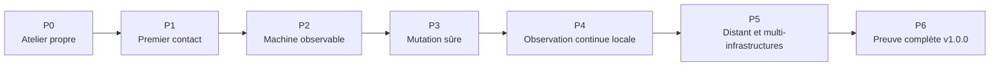

# Roadmap de construction

Cette roadmap transforme la vision en paliers vérifiables. Un palier ajoute une difficulté principale, réutilise les preuves du précédent et se termine dans une VM de LAB propre.

Les paliers ne produisent pas automatiquement de tags. Les commits conservent leur histoire ; `v1.0.0` reste réservé au parcours complet.

## Vue d’ensemble

| Palier | Résultat visible pour l’utilisateur | Difficulté nouvelle | Preuve de sortie |
|---|---|---|---|
| P0 | Le nouveau projet est compréhensible et développable en sécurité | Repartir proprement sans perdre l’histoire | Nouveau dépôt privé, branche `old-project`, LAB documenté, aucun code mort repris |
| P1 | La console examine une machine sans la modifier | Établir le premier lien de confiance SSH | Audit d’une VM neuve, clé d’hôte enregistrée, seconde exécution identique, zéro mutation |
| P2 | Une machine apparaît comme disponible et observable | Identité persistante et daemon read-only | Enrôlement d’une VM, état signé vérifié, aucun port entrant du daemon |
| P3 | La machine peut être sécurisée sans perdre l’accès | Première mutation à risque et retour maîtrisé | Nouvelle session SSH, pare-feu dual-stack, re-run `changed=0`, dérive détectée |
| P4 | L’état reste disponible lorsque le laptop est éteint | Composant toujours allumé et protocole de télémétrie | Coordinateur local, coupure console, journal repris, aucun arrêt de service causé par le pilotage |
| P5 | Plusieurs sites et infrastructures sont observés à distance | Réseau distribué, NAT et migration progressive | VPS sans domaine obligatoire, machine pilote, aucune entrée de télémétrie vers le LAN, deux infrastructures distinctes |
| P6 | Le produit accomplit et restaure tout le parcours V1 | Cycle de vie complet et qualité de release | LAB complet, restauration de console, renouvellement, mise à jour, artefacts et documentation vérifiés |

## P0 — Atelier propre

> État : terminé le 2026-07-12. La nouvelle lignée, le LAB, l’audit de
> réemploi et les ADR 0001 à 0011 ont été relus et ratifiés.

### But

Créer la nouvelle lignée sans transporter le code mort de l’ancien wrapper Ansible.

### À accomplir

- créer le nouveau dépôt privé en conservant l’historique Git ;
- placer l’ancienne tête sur la branche `old-project` ;
- repartir d’une branche principale propre avec les documents du nouveau produit ;
- réécrire `AGENTS.md` dans un ton humain, avec deux rôles simples et les garde-fous réellement utiles ;
- définir l’arborescence console, daemon, coordinateur, protocole et engine Ansible ;
- mettre à niveau les gabarits `labctl` vers Debian 13 et documenter le LAB rapide puis le LAB complet ;
- décider ce qui est réutilisé de l’ancien code après audit, sans déplacement massif par défaut.

### Preuve de sortie

L’historique ancien reste consultable, le nouveau `main` ne contient aucun composant applicatif mort et un nouveau contributeur comprend la direction depuis le guide. Aucun binaire ou test du projet n’a été exécuté sur le laptop.

## P1 — Premier contact en lecture seule

> État : terminé le 2026-07-12. Le premier contact, la répétabilité, le refus
> d'ambiguïté et l'API locale sont prouvés dans le LAB `quick`.

### But

Permettre à la console Python de connaître une cible sans lui faire confiance aveuglément et sans la modifier.

### À accomplir

- poser le squelette de la CLI et de l’API locale sur socket Unix ;
- créer le modèle minimal des machines et infrastructures, avec schéma versionné ;
- cibler une machine par SSH sans modifier les fichiers SSH personnels ;
- enregistrer la première clé d’hôte par empreinte fournisseur ou TOFU visible ;
- produire l’audit minimal Debian 13 amd64 ;
- afficher les conflits, limites et refus dans un langage compréhensible.

### Preuve de sortie

Sur une VM Debian 13 neuve, la console affiche l’audit et le plan potentiel. Une deuxième lecture produit le même résultat. Une cible incompatible ou ambiguë est refusée avant toute mutation. Voir la [preuve LAB P1](lab/p1-premier-contact.md).

## P2 — Machine observable

> État : terminé le 2026-07-12. L'enrôlement, l'identité persistante, la file
> bornée, l'inspection signée et les refus de modification et de rejeu sont
> prouvés dans le LAB `quick`.

### But

Enrôler une machine et obtenir un état signé sans lui donner de pouvoir d’administration.

### À accomplir

- construire le daemon Go natif et son unité systemd ;
- créer une identité individuelle dont la clé privée reste sur la machine ;
- installer la file SQLite bornée et les séquences persistantes ;
- collecter uniquement la télémétrie V1 minimale ;
- permettre une inspection ponctuelle depuis la console ;
- représenter la machine comme disponible avant toute affectation à une infrastructure.

### Preuve de sortie

Une VM nue devient observable, son état signé est accepté par la console et une enveloppe modifiée ou rejouée est refusée. Le daemon ne possède aucun port entrant et le désenrôlement n'affecte aucun service hébergé. Voir la [preuve LAB P2](lab/p2-machine-observable.md).

## P3 — Première mutation sûre

> État : terminé le 2026-07-12. Le nouveau compte, le kit de récupération, les
> connexions IPv4 et IPv6, le rollback, l'idempotence et le refus de dérive sont
> prouvés dans le LAB `quick`.

### But

Appliquer le premier profil Linux sans bloquer l’opérateur ni écraser une autorité existante.

### À accomplir

- créer ou adopter le compte d’administration non-root propre à la machine ;
- mettre en place le stockage chiffré de la console et son kit de récupération ;
- séparer la préparation du chemin d’administration du profil de sécurisation ;
- appliquer SSH key-only, le pare-feu nftables IPv4/IPv6 et les paramètres `sysctl` justifiés ;
- préparer les anciennes configurations et conserver la session de bootstrap ;
- détecter la dérive sans réparation silencieuse ;
- proposer la politique de correctifs Debian de sécurité sans reboot automatique.

### Preuve de sortie

Une connexion SSH réellement nouvelle et `sudo` sont prouvés avant fermeture de l’ancien accès. Le pare-feu fonctionne en IPv4 et IPv6. Une seconde application donne `changed=0`. Une modification manuelle est montrée dans un plan, jamais écrasée automatiquement. Voir la [preuve de sécurisation](lab/securiser-une-machine.md).

## P4 — Observation continue locale

> État : terminé le 2026-07-12. Le coordinateur local, les identités mTLS
> séparées, les accusés durables, la coupure du coordinateur et l'extinction de
> la console sont prouvés dans le LAB `quick`.

### But

Conserver l’état des machines lorsque le laptop est éteint, sans imposer un VPS.

### À accomplir

- construire le coordinateur Go sous un compte séparé ;
- mettre en place le mTLS et les identités distinctes daemon, coordinateur et console ;
- versionner le contrat Protobuf et les enveloppes signées ;
- enregistrer durablement les accusés et l’historique borné dans SQLite ;
- permettre la colocalisation daemon-coordinateur sur une petite machine ;
- exposer les diagnostics uniquement en local.

### Preuve de sortie

Le laptop est arrêté pendant plusieurs cycles, puis la console retrouve l’état et le journal. Une coupure du coordinateur ne provoque aucun arrêt de service ; le daemon conserve ses événements et republie l’état courant à la reprise.

Voir la [preuve LAB P4](lab/p4-observation-continue-locale.md).

## P5 — Mode distant et multi-infrastructures

> État : terminé le 2026-07-12. Flux distant, NAT, deux infrastructures,
> migration pilote, fallback, reconstruction, retrait séparé et schéma 2 des
> domaines de panne sont prouvés dans le LAB `v1-full`.

### But

Observer plusieurs sites à travers Internet sans ouvrir le LAN et sans imposer un domaine.

### À accomplir

- installer un coordinateur sur un VPS géré et sécurisé ;
- prendre en charge un point par IP ou DNS optionnel ;
- borner le serveur public mTLS et ne publier aucune route anonyme ;
- migrer une machine pilote par site en conservant l’ancien point comme secours ;
- gérer plusieurs infrastructures, plusieurs machines et les mouvements entre elles ;
- distinguer domaine de panne détecté, déclaré et inconnu ;
- prouver la consultation distante avec une identité de console read-only.

### Preuve de sortie

Le LAB complet contient une console, un coordinateur public simulé, une passerelle et au moins deux machines privées réparties dans deux infrastructures. Aucune machine privée n’accepte de connexion de télémétrie entrante. La perte du coordinateur est affichée honnêtement et sa reconstruction permet aux daemons de revenir.

Voir la [preuve LAB P5](lab/p5-mode-distant.md).

## P6 — Release V1 complète

### But

Transformer les composants prouvés séparément en un produit installable, récupérable et documenté de bout en bout.

### À accomplir

- déplacer, désaffecter, désenrôler et désinstaller une machine sans toucher à ses services ;
- révoquer et renouveler une identité sans confondre adresse et machine logique ;
- mettre à jour coordinateurs puis daemons par machine pilote et rollback préparé ;
- restaurer la console, ses secrets et son registre depuis le kit prévu ;
- vérifier les limites de ressources du daemon et du coordinateur ;
- publier les artefacts signés, sommes de contrôle et instructions d’installation ;
- exécuter le parcours débutant et le parcours avancé dans le LAB complet ;
- fermer les écarts de documentation et les anciennes règles devenues obsolètes.

### Preuve de sortie

Une VM de console neuve restaure son état, reprend une flotte existante, observe deux infrastructures et applique un plan idempotent sans réenrôlement. Les preuves de sécurité, coupure, reprise et mise à jour sont reproductibles. Alors seulement une release candidate puis le tag `v1.0.0` peuvent être créés.

## Horizons après `v1.0.0`

Ces horizons donnent une direction au guide, mais ne sont pas encore des contrats de release.

### Génération services

Déclarer un service, choisir son placement, l’exposer par un chemin maîtrisé et le protéger par un service d’identité optionnel. Les premiers scénarios viseront le portfolio, Vaultwarden et Authelia. Les runtimes resteront des adaptateurs et leur choix fera l’objet de preuves dédiées.

### Génération résilience

Décrire et tester une politique de sauvegarde 3-2-1, utiliser une machine dédiée ou une destination S3, restaurer réellement les données, séparer les domaines de panne et prouver plusieurs coordinateurs avant d’employer le terme haute disponibilité.

### Génération infrastructure complète

Ajouter les intégrations Proxmox et OPNsense, le Raspberry Pi de sauvegarde, les chemins WireGuard d’administration et d’exposition, puis réaliser l’architecture cible complète sans boucle de dépendance avec l’IAM ou les services gérés.

Les numéros `v2`, `v3` et suivants seront affectés seulement lorsque le contenu et les incompatibilités de ces générations seront suffisamment connus. La roadmap évite ainsi de promettre aujourd’hui une chronologie artificielle.
