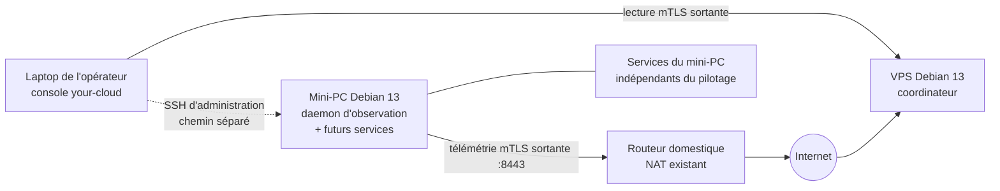

# Scénario simple — un VPS et un mini-PC à la maison

Ce scénario est cohérent pour commencer sans OPNsense, Proxmox ni autre
passerelle gérée par le produit. Il correspond au mode distant minimal de la V1.

## Où tourne chaque composant

| Machine | Composant nécessaire | Pourquoi |
|---|---|---|
| laptop | console Python | présente les plans, garde les autorités et administre par SSH |
| VPS | coordinateur Go | reste joignable et conserve l'état lorsque le laptop est éteint |
| mini-PC | daemon Go | observe localement et initie la connexion vers le VPS |

Le routeur domestique n'ouvre aucun port de télémétrie vers le mini-PC. Il doit
seulement autoriser ses connexions sortantes. Le VPS publie le port mTLS choisi,
`8443` dans la preuve, et refuse les clients sans certificat approuvé.

Le chemin SSH est indépendant. Depuis l'extérieur, il vaut mieux le porter par
un WireGuard d'administration déjà maîtrisé plutôt que publier directement SSH
du mini-PC. La V1 utilise ce chemin mais ne prétend pas encore installer toute
la topologie WireGuard ou gérer OPNsense.

## Le coordinateur peut-il cohabiter avec un daemon ?

Oui. Une même machine Debian peut porter les deux binaires, mais ils restent
deux composants séparés :

| Aspect | Coordinateur | Daemon d'observation |
|---|---|---|
| compte | `your-cloud-coordinator` | `your-cloud-observer` |
| données | `/var/lib/your-cloud/coordinator` | `/var/lib/your-cloud/observer` |
| réseau | écoute mTLS bornée | aucun port entrant |
| autorité | conserve la télémétrie | observe seulement sa machine |
| secrets | identité serveur mTLS | identité machine et client mTLS |

Sur le VPS, ajouter un daemon permet d'observer la santé du VPS lui-même. Ce
n'est pas nécessaire au fonctionnement du coordinateur. Pour une première
installation facile à comprendre, la recommandation est donc : coordinateur
seul sur le VPS, daemon seul sur le mini-PC. Le daemon du VPS pourra être enrôlé
ensuite comme une machine ordinaire, sans fusionner les deux rôles.

Le coordinateur est important pour l'observation continue, mais il n'est pas
essentiel au fonctionnement des services. S'il tombe, l'état devient ancien et
les changements distants attendent ; les services du mini-PC continuent. Il ne
porte aucune clé SSH, aucun secret applicatif et aucune autorité d'exécution.

## VPS public, zone d'exposition et DMZ

Un VPS public appartient naturellement à une zone d'exposition. Cela ne suffit
pas à en faire une DMZ au sens du produit : une DMZ est une frontière de
sécurité qui isole les composants exposés des services et données, pas le nom
d'une machine ni un synonyme de VPS.

Dans ce scénario, le VPS ne relaie aucun accès d'administration vers le LAN et
ne devient pas une passerelle de confiance. Il reçoit seulement les connexions
mTLS sortantes des daemons et les lectures mTLS de la console. Cette séparation
reste cohérente même si le VPS est compromis : les clés d'administration et les
secrets des services ne doivent pas s'y trouver.

Plus tard, héberger un nœud d'entrée, k3s ou un service public sur le même VPS
place ces charges et le coordinateur dans le même domaine de panne et le même
noyau. C'est un compromis acceptable pour une petite installation, pas une DMZ
fortement isolée. La cible plus sûre est alors de séparer le coordinateur dans
une autre VM ou un petit VPS, et de garder les charges publiques dans leur zone
d'exposition. Proxmox, surtout s'il administre les VM locales, ne doit pas être
traité comme un simple service public sur ce VPS sans conception dédiée.

Sur un homelab sans VPS, le coordinateur et le daemon peuvent aussi cohabiter
sur le mini-PC en mode local. Dans ce cas la console ne retrouve l'observation
continue depuis Internet que si un chemin réseau privé rend ce mini-PC
joignable ; ce n'est pas le scénario distant recommandé ici.

## Correspondance avec le LAB

| Installation réelle | Simulation `v1-full` |
|---|---|
| VPS | `lab-coordinateur` sur `lab-public` |
| routeur/NAT domestique | `lab-gateway` |
| mini-PC local | `lab-machine-1` sur `lab-site-private` |
| laptop | `lab-console` |

La lecture ciblée P6 a reçu un état récent de `lab-machine-1` à la séquence 200
via `lab-coordinateur`, avec provenance `coordinateur-mtls +
signature-ed25519-verified`. Le coordinateur a consommé moins de 6 Mio au pic et
le daemon environ 8 Mio, tous deux sous leurs budgets systemd. La preuve P5 a
déjà montré qu'aucune connexion de télémétrie entrante n'atteignait les machines
du site privé.

Le LAB complet ne se réduit pas à ce scénario. Il conserve les six VM, deux
infrastructures, la console de récupération, les coupures, migrations,
renouvellements, mises à jour, budgets et artefacts. Les variantes couvertes
sont suivies explicitement : coordinateur local colocalisé à P4, coordinateur
distant dédié à P5/P6, et coordinateur distant colocalisé avec son propre daemon
dans la preuve complémentaire P6.

Cette dernière variante a été exécutée : le daemon RC de `lab-coordinateur` a
publié vers le coordinateur de la même machine, l'état signé a été accepté à la
séquence 208 et le re-run a donné `changed=0`. Les deux machines privées sont
restées visibles aux séquences 207 et 208.

Ce scénario ne valide pas encore OPNsense, la gestion d'un hyperviseur, les
services applicatifs ni leur exposition. Ces sujets peuvent former le palier
suivant sans remettre en cause cette base.
