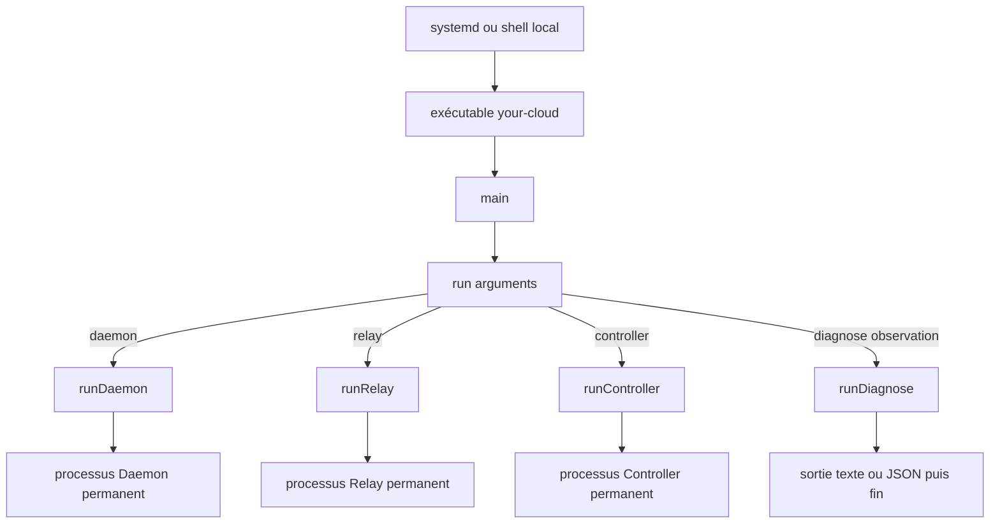
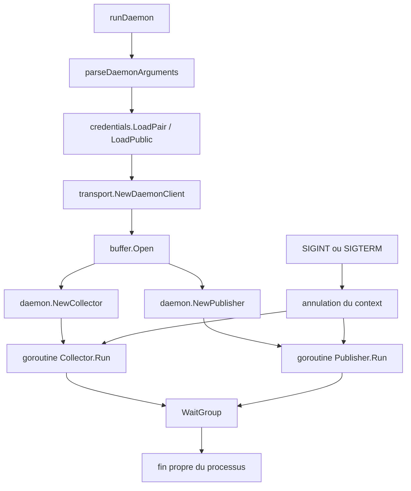
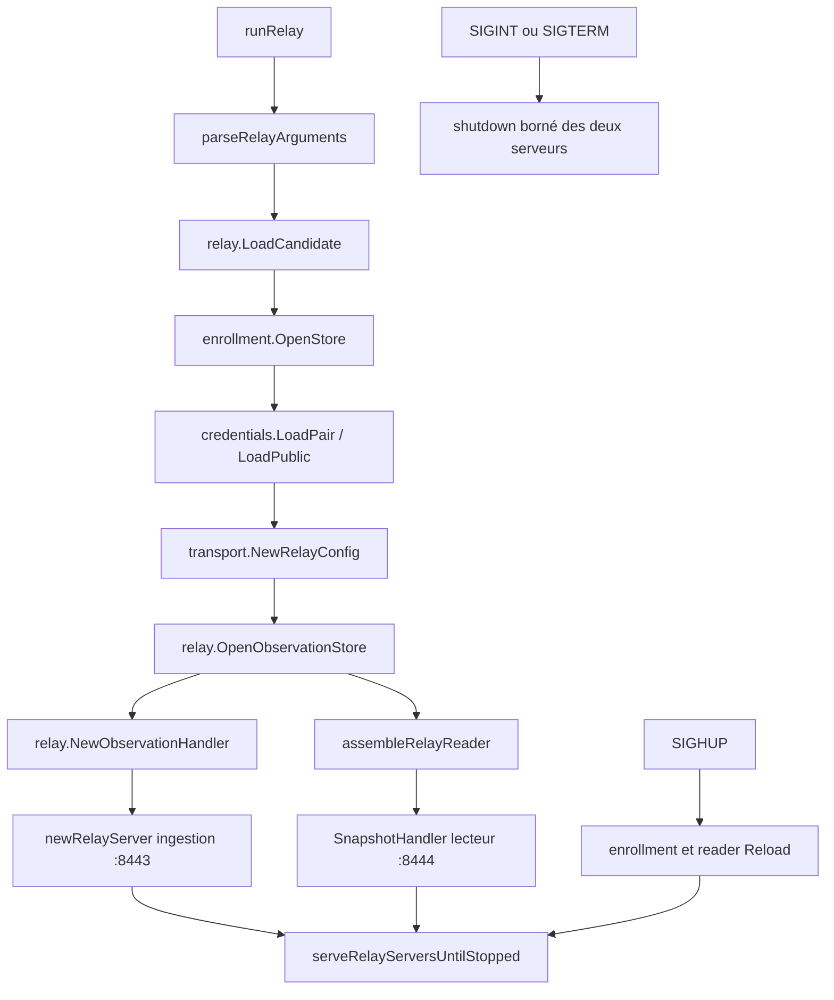
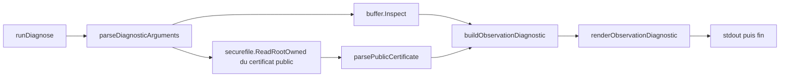
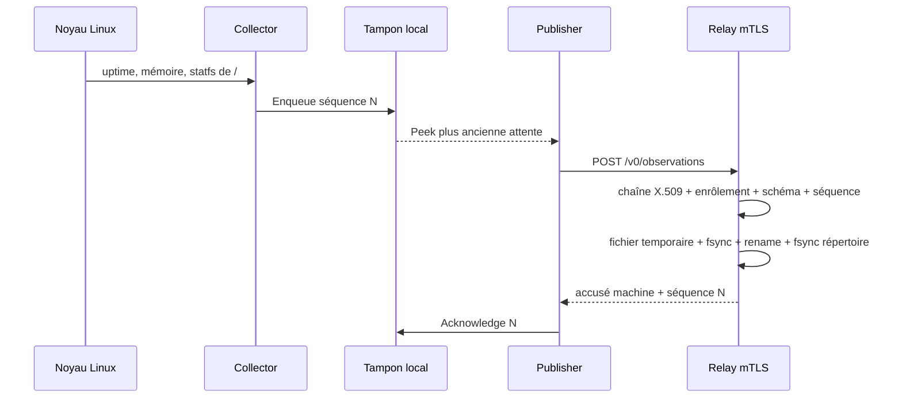

# Chaîne d'observation — carte technique

> Ce guide explique les capacités du produit : où le code s'exécute, qui
> appelle quoi, quelles données circulent et quelles limites de sécurité
> demeurent. Les rapports sous [`docs/lab/`](../lab/) portent seuls les dates,
> commits et résultats d'exécution.

Une [édition HTML autonome et visuelle](../html/chaine-observation.html)
accompagne cette source canonique.

## Pourquoi cette carte existe

Une fonction peut être courte et correcte tout en restant difficile à replacer
dans le produit. Cette carte complète donc le code avec les questions de cycle
de vie :

- qui lance le binaire et avec quel rôle ;
- quelle fonction assemble chaque processus ;
- quels packages portent la logique métier ;
- où vivent les certificats, les états et les limites ;
- quels algorithmes sont utilisés et pourquoi ;
- quels chemins historiques restent couverts par leurs tests sans être
  assemblés dans les processus courants.

## Les notions avant les appels

- L'**Agent** est l'installation locale de Your Cloud. Ce n'est pas un
  processus supplémentaire.
- L'**artefact** est le fichier exécutable unique `your-cloud`.
- Un **rôle** est choisi au lancement : `daemon`, `relay`, `controller` ou
  `diagnose`.
- Un **processus** est une exécution en mémoire de l'artefact. Deux rôles lancés
  séparément restent deux processus indépendants.
- Une **goroutine** est une fonction exécutée concurremment dans le même
  processus Go. Elle ne crée ni VM, ni service, ni worker d'automatisation.
- Un **collecteur** lit une source locale fixe et produit une donnée typée.
- Une **observation** est l'enveloppe JSON versionnée qui regroupe les trois
  résultats `host-health.v1`.
- Le **tampon** conserve localement les observations non encore accusées.
- Une **lacune** décrit explicitement les séquences supprimées lorsque le
  tampon atteint une limite.
- Le **diagnostic** est une commande ponctuelle en lecture seule. Ce n'est pas
  une unité systemd et elle n'ouvre aucun port.

<!-- coherence: AGENT-AUTHORITY:start -->
## Placement des capacités

Cette section décrit les processus réellement présents dans `v0.0.2` et dans la
porte de lecture `v0.0.3`. L'Auxiliaire appartient désormais au contrat de
`v0.1.0`,
mais il n'est encore ni implémenté ni prouvé et ne doit pas être inventé dans
la chaîne actuelle.

```text
machine administrée                  machine d'observation
`- processus daemon                 |- processus daemon
    `- aucune écoute entrante        |- processus relay
                                     |   |- ingestion mTLS :8443
                                     |   `- lecture mTLS :8444
                                     `- états et autorités séparés

machine de contrôle                  poste humain
`- processus controller             `- Console Tauri installée
    `- API privée HTTPS :9443            `- aucun serveur local
```

Le même exécutable Go fournit Daemon, Relay et Controller. Chaque rôle possède
son processus, son compte, ses credentials et son répertoire d'état. Une
colocalisation ne fusionne pas ces autorités, même si un même administrateur
`root` peut alors compromettre les deux. Le rôle Relay reste refusé sans
manifeste candidat root-owned.

Les rôles partagent l'artefact, pas leur autorité :

| Rôle | Peut lire | Peut modifier | Réseau |
|---|---|---|---|
| Daemon | son certificat, sa clé, la CA Relay, les trois sources système fixes et, si elle existe, la fiche root-owned des ports de loopback déclarés externes | son tampon sous `/var/lib/private/your-cloud-daemon` | HTTPS sortant vers l'origine Relay exacte |
| Relay | ses certificats, ses CA, le registre et les manifestes root-owned | son état sous `/var/lib/private/your-cloud-relay` | ingestion `:8443` et lecteur privé `:8444` séparés |
| Controller | ses identités, l'inventaire métier et le cache Relay | ses états privés Controller | lecture mTLS sortante vers le Relay et API privée `:9443` |
| Diagnose | lancé ponctuellement par `root`, certificat public Daemon et état local déjà produit | rien | aucun accès réseau |

## Du système à la fonction Go



[`cmd/your-cloud/main.go`](../../cmd/your-cloud/main.go) est le seul sélecteur
de rôle. `main()` transmet `os.Args[1:]` à `run()`. `run()` refuse un rôle
inconnu, puis appelle exactement l'une des quatre fonctions d'assemblage.

Le dossier `cmd/` est donc la **couture** du programme : il relie arguments,
credentials, stockage, réseau et arrêt propre. La logique détaillée reste dans
`internal/` afin d'être testable sans démarrer le processus complet.

## Chemin `daemon`

L'unité [`your-cloud-daemon.service`](../../tests/lab/v0.0.2/deploy/your-cloud-daemon.service)
lance :

```text
your-cloud daemon
  --machine-id=<identité fixée par l'installation>
  --relay-url=https://relay.observation.your-cloud.test:8443
```

`runDaemon` ne récupère pas toute sa configuration dans l'environnement :

- `machine-id` et `relay-url` sont des arguments de commande produits par
  systemd ;
- seul `CREDENTIALS_DIRECTORY` vient de l'environnement créé par
  `LoadCredential=` afin de localiser les copies privées temporaires des
  credentials systemd.



Les deux « workers » sont seulement deux goroutines du même Daemon :

1. **Collector** : collecte immédiatement, puis toutes les trente secondes. Il
   lit `/proc/uptime`, `/proc/meminfo` et les statistiques de `/`, construit
   une observation et la persiste dans le tampon.
2. **Publisher** : lit la plus ancienne observation en attente, l'envoie au
   Relay, vérifie l'accusé exact puis la retire. Si le Relay est indisponible,
   il conserve le tampon et applique un backoff borné.

Cette séparation permet à la collecte de continuer pendant une panne Relay.
Le `context` commun demande l'arrêt aux deux goroutines ; le `WaitGroup` attend
qu'elles aient réellement terminé avant que `runDaemon` retourne.

## Chemin `relay`

L'unité
[`your-cloud-relay.service` de `v0.0.3`](../../tests/lab/v0.0.3/deploy/your-cloud-relay.service)
prolonge l'unité d'observation `v0.0.2` avec le lecteur privé du Controller et
lance le rôle uniquement sur la candidate :

```text
your-cloud relay --listen=192.168.243.153:8443
```



L'ordre est une frontière de sécurité : adresse, candidature, enrôlement,
credentials et stockage sont validés avant l'ouverture du socket. Le callback
d'autorisation est appliqué pendant la négociation TLS et à chaque requête ;
une révocation rechargée ne dépend donc pas d'une nouvelle connexion.

La frontière d'ingestion `:8443` expose uniquement
`POST /v0/observations`. La frontière reader distincte `:8444`, ouverte
seulement lorsque son registre, son manifeste et ses credentials sont valides,
expose uniquement `GET /v0/snapshot`. Aucune des deux ne possède de route
d'enrôlement ou d'action, et aucune réponse au Daemon ne contient un ordre.

## Chemin `diagnose`

La commande est appelée manuellement par `root` sur la machine concernée :

```text
your-cloud diagnose observation
your-cloud diagnose observation --format=json
```



Le privilège administratif sert uniquement à lire le tampon protégé du compte
dynamique sous `/var/lib/private`. Le diagnostic ne transforme pas le Daemon en
processus root, ne devient pas une unité systemd et ne reçoit aucune autorité
réseau.

Son rôle est d'expliquer l'état local du Daemon sans dépendre du Relay :
identité, version, profil, endpoint fixe, expiration du certificat, dernière
collecte, dernière livraison, état `available` ou `unavailable`, taille des
enveloppes en attente, prochaine séquence et nombre de lacunes.

`buffer.Inspect` lit sans créer, réordonner, purger ou réécrire. La commande
refuse un chemin, un sujet ou un format libre. Elle ne montre ni clé privée ni
valeurs de santé collectées.

Le chemin prévu pour `v0.1.0` n'ajoute aucun ordre à ces rôles : une identité
SSH propre
à la machine et une commande forcée lanceront `your-cloud auxiliary` comme processus
ponctuel séparé. Le Daemon et le Relay resteront non privilégiés et consacrés à
l'observation. Cette cartographie n'ajoutera l'Auxiliaire à ses fonctions et
fichiers qu'après son implémentation réelle.

<!-- coherence: AGENT-AUTHORITY:end -->

<!-- coherence: V1-APP-ACCESS:start -->
## Chemin Controller–Relay–Console

La séparation des responsabilités et le sens de lecture ci-dessous sont des
invariants du produit. Le Relay reçoit les observations des Daemons sur une
frontière et rend un instantané au Controller sur une autre. La Console appelle
le Controller ; elle n'appelle jamais directement le Relay.

Le listener TLS `8443` est réservé aux Daemons : il fait confiance à
l'autorité cliente des Daemons et exige leur enrôlement dès la connexion. Ajouter
simplement une route Controller sur ce listener mélangerait donc deux classes
d'identité. Le lecteur Controller emploie un listener distinct sur l'adresse
privée exacte du Relay et `8444`, sans modifier la route d'ingestion `8443`.

Le trajet de lecture respecte ce sens :

```text
Daemon -- POST mTLS --> Relay
   `- aucune connaissance du Controller

Controller -- GET /v0/snapshot mTLS :8444 --> Relay
Controller <-- dernier état validé, séquence et lacunes -- Relay
Console installée -- API privée authentifiée --> Controller
Console installée <-- synthèse bornée -- Controller
```

La Console Tauri 2 appelle chaque Controller sur une origine HTTPS TLS 1.3
exacte. Son frontend React, TypeScript et Vite embarqué n'obtient aucun client
réseau général : l'enveloppe native ajoute l'identité d'appareil mTLS et la
session humaine opaque. L'API REST JSON expose seulement l'initialisation et la
lecture de l'unique infrastructure, la lecture de son instantané de machines et
le rattachement idempotent d'une machine déjà enrôlée. Elle refuse route, query,
méthode, schéma, taille, délai, concurrence, Controller et infrastructure hors
contrat.

Linux et Windows emploient le même coffre Tauri Stronghold, déverrouillé par une
phrase secrète locale dérivée avec Argon2id. Il conserve des clés d'appareil et
humaines distinctes par Controller. Le cœur natif signe la preuve humaine ; le
Controller refuse les challenges rejoués, expirés ou liés à une autre origine.
Le frontend ne reçoit aucune clé ni session. Windows Hello, passkeys, FIDO2 et
SSO/OIDC restent postérieurs à `v0.1.0`.

La phrase contient six mots français aléatoires. L'autorité locale du Controller
ouvre `9444` dix minutes au plus pour un appairage ou une récupération épinglé,
sans route métier permanente. Un seul humain et un appareil sont actifs par
Controller dans ce palier. Le certificat d'appareil P-256 vaut 180 jours ; sa
rotation manuelle prépare un candidat sans pouvoir métier puis ne révoque
l'ancien qu'après activation prouvée. La session opaque expire après 30 minutes
d'inactivité ou huit heures absolues et reste liée au certificat et à
`infrastructure_id`. Le code global de récupération de 256 bits reste hors
ligne et dérive une clé publique différente par Controller.

Le Controller initie la lecture. Le Relay connaît néanmoins l'interface et l'IP
source privées exactes provisionnées pour ce Controller : son filtre `nftables`
refuse `8444` par défaut et n'accepte que cette source. Les autres paquets sont
supprimés par `drop`, sans réponse, et même la source admise est limitée à une
rafale de quatre nouveaux TCP puis douze par minute. Une IP privée n'est pas une
identité ; TLS 1.3 mTLS reste obligatoire avec une CA serveur reader et une CA
cliente Controller Ed25519 dédiées à l'infrastructure. Le serveur exige le
nom exact
`relay-reader.<infrastructure-id>.your-cloud.test` et le certificat
client l'URI
`urn:your-cloud:controller-reader:<infrastructure-id>:<controller-id>`.

Le Controller génère et persiste ses `controller_id` et `infrastructure_id`
UUIDv4 immuables avant l'appairage. Le manifeste lecteur root-owned de 4 Kio au
plus les importe, épingle URI, série, empreinte et état puis les revérifie à
chaque requête. Le registre Daemon migre explicitement du schéma 1 vers un
schéma 2 de zéro à 64 machines portant l'UUID d'infrastructure ; une migration
candidate invalide laisse `8443` disponible mais maintient `8444` fermé.
Registre Daemon, manifeste lecteur, certificats, origine, configuration
Controller et réponse doivent tous porter le même `infrastructure_id`, sans
inférence depuis le réseau.

Seul `GET /v0/snapshot`, sans corps, query, filtre ou pagination, est accepté.
La réponse JSON stricte, dont le schéma et les erreurs sont à liste positive,
est pré-encodée avant son premier octet. Elle contient de zéro à 64 entrées
issues du registre courant, chacune `active` ou `revoked`, avec le dernier état
et les lacunes ou `observation: null`. Un verrou logique unique copie registre
et observations et capture `snapshot_at` avant le tri. En-têtes de 8 Kio,
réponse de 2 Mio, erreur de 1 Kio, délais de 3 et 6 secondes, quatre sockets, une
requête simultanée et douze connexions et lectures par minute ferment la
consommation. Une
Console installée contacte ses Controllers approuvés, jamais le Relay. Un
Controller porte une infrastructure ; une Console peut conserver plusieurs
associations indépendantes.

Une machine ne peut entrer dans l'inventaire que si cette lecture réussit dans
la même opération et confirme son enrôlement `active`. Le dernier cache n'a pas
ce pouvoir. Une VM hostile située sur le même réseau LAB doit prouver d'abord le
refus IP, puis dans une phase isolée le refus mTLS et applicatif, avant de
réaffirmer l'ingestion, la lecture saine et l'inventaire inchangé.

La future liaison WireGuard Console–Controller, postérieure à `v0.1.0`, reste
un chemin d'accès distinct
de cette chaîne d'observation. La Console devra la présenter comme une opération
de connexion bornée à l'infrastructure choisie, avec déverrouillage et fermeture
explicites, sans transporter la clé par le Relay ni ajouter ce mécanisme à
`v0.1.0`
ou à `v0.0.3`.

| Sujet | Relay | Controller |
|---|---|---|
| Enrôlement machine | applique le registre d'autorisation local provisionné par root et refuse immédiatement | porte l'inventaire métier attendu sans pouvoir modifier le registre Relay |
| Réception | authentifie le Daemon, valide le schéma et persiste avant accusé | relit sans faire confiance aveuglément à la donnée reçue |
| Séquence et lacune | contrôle et conserve le dernier fait d'observation validé | interprète l'impact et fournit l'état métier à la Console |
| Fraîcheur | fournit `received_at` et `snapshot_at` en UTC `Z` | calcule leur différence, poursuit sur son horloge monotone, refuse une dérive inter-hôtes supérieure à 30 s, rend `recent` jusqu'à 90 s incluses puis `old` |
| Utilisateurs et rôles | aucun | authentifie l'humain et autorise la consultation ou l'action |
| Plans et exécution | aucun | prépare le plan puis utilise un chemin d'action distinct |

Pour le premier Controller en lecture seule, l'enrôlement reste provisionné
manuellement comme dans `v0.0.2`. La migration locale du registre ajoute
seulement l'UUID d'infrastructure généré par le Controller ; elle ne synchronise
pas l'inventaire métier et le Controller ne peut pas la déclencher. Les
autorités privées reader restent hors du Relay et du Controller ; les feuilles
de 180 jours tournent manuellement, listener fermé. Le bundle client sur le
Controller et le manifeste sur le Relay sont chacun publiés atomiquement sur
leur hôte, puis recoupés avant réouverture, sans deux lecteurs actifs. Leur
révocation vient du manifeste cryptographique et ne se déduit pas de
l'inventaire métier.

L'accusé actuel signifie seulement « la séquence exacte est durable sur le
Relay ». Il autorise le Daemon à retirer cette attente ; il ne prouve ni que le
Controller l'a lue, ni qu'un utilisateur l'a vue. Le Relay conserve le dernier
état accepté par machine, pas un historique de séries temporelles. Une rétention
historique ou un accusé de bout en bout demanderait donc un autre contrat.

La première lecture est par conséquent un instantané. Si les séquences 10, 11 et
12 sont acceptées entre deux lectures du Controller, celui-ci peut ne recevoir
que 12. Ce remplacement n'est pas une `Lacune d'observation` : ce terme désigne
uniquement un intervalle supprimé du tampon borné du Daemon. Une livraison
exhaustive ou une série temporelle exigerait un stockage et un protocole
différents.

La fraîcheur ne repose pas sur `observed_at`, déclaré par l'horloge de la
machine observée. Fuseau local et dérive sont distincts : toutes les dates
réseau sont rendues en RFC 3339 nanoseconde UTC `Z`. Le Controller calcule
`snapshot_at - received_at`, refuse un résultat négatif, puis ajoute le temps
monotone écoulé. Il exige aussi `snapshot_at` dans l'intervalle UTC
`[fin - 30 s, départ + 30 s]` et compare durée civile et monotone : un écart
supérieur à une seconde signale une correction d'horloge. Hors de ces bornes,
aucune donnée n'est récente. L'écart `observed_at - received_at` reste visible
mais n'est pas une autorité de fraîcheur ; sa valeur absolue supérieure à 30
secondes produit seulement un avertissement. NTP reste une précondition mesurée,
pas une autorité du produit. Panne, horloge non fiable, enrôlement, fraîcheur et
lacune restent des dimensions séparées : une panne ne devient ni `old`, ni
`absent`.

Le Controller non-root conserve deux fichiers privés et atomiques :
`inventory.json` est l'autorité métier bornée à 64 machines et
`relay-cache.json` est seulement le dernier snapshot P5 validé, borné à 2 Mio.
Un nouveau rattachement persiste d'abord le cache frais puis l'inventaire ; un
renommage déjà rattaché reste local. Après redémarrage ou échec, le cache peut
rester visible mais vaut `unavailable`. Omission d'une machine, réactivation,
observation disparue, séquence décroissante ou lacune supprimée refusent son
remplacement sans toucher à l'inventaire.

`GET /v0/machines` ne rend que les machines attendues sous 128 Kio. Les plages
de lacunes complètes restent dans le cache ; la Console reçoit leur nombre, le
total supprimé et leurs deux bornes de séquence, sans troncature silencieuse.
Les libellés sont des textes Unicode NFC bornés et validés par liste positive ;
ils restent non autoritaires et l'identifiant de machine demeure visible.
La Console n'invente aucune machine dédiée au Relay : son indisponibilité est
un état de transport de l'infrastructure. Un hôte qui exécute aussi le Daemon
reste une machine normale de l'inventaire ; aucun badge de placement n'est rendu
car cette API ne publie pas ce fait.

Une architecture ultérieure peut faire cohabiter Relay et Controller, mais elle
partagerait la zone de compromission root et son filtre IP ne distinguerait pas
les processus locaux. `v0.0.3` choisit donc deux IPv4 privées distinctes et ne
revendique aucun mode loopback : `lab-coordinateur` porte le Controller et
`lab-machine-1` le Relay pendant la preuve.
Un placement plus exposé du Relay ne doit pas entraîner ultérieurement le
Controller dans la même zone sans accepter explicitement ce risque.

La compromission root de l'hôte Relay permet de lire ou d'altérer son état après
terminaison TLS. Une signature de bout en bout pourrait rendre une altération
détectable par le Controller, mais ne cacherait pas les données au Relay ;
intégrité, authenticité et confidentialité de bout en bout restent donc trois
questions distinctes, hors de `v0.0.2`.

Le système visuel, les sept vues et les couches de preuve de l'incrément
Console–Controller sont décidés. Le fonctionnel Linux a été implémenté et
prouvé sur `v1-full`, avec le Relay et un Daemon colocalisés sur
`lab-machine-1`. Après une matrice historique, la porte native Linux/Windows
finale `30710037004` a entièrement réussi sur le candidat produit exact
`3b8f81f`, sans topologie multi-VM simulée. L'issue `#9` relie ce run, le SHA et
son intégration par fast-forward : `v0.0.3` est fermée pour ce candidat exact.
Le transport conserve atomiquement son dernier snapshot comme `indisponible`
après panne ou restart, reprend à la demande avec un backoff
`1/2/4/8/16/30 s` et ne transmet jamais ses 2 Mio bruts à l'API Console bornée
à 128 Kio. Le Controller initial reste en lecture seule : aucun SSH, Ansible,
plan appliqué, SSO obligatoire, session utilisateur publique ou canal d'action
n'est ajouté au Relay.
<!-- coherence: V1-APP-ACCESS:end -->

<!-- coherence: V1-OBSERVATION:start -->
## Trajet d'une observation



Une observation contient exactement : version de schéma, identité machine,
version Daemon, profil, séquence persistante, heure de collecte, résultats des
trois collecteurs et éventuelles lacunes. Depuis `#107` elle porte en plus une
section absente par défaut : sur une machine dont une fiche root-owned nomme des
ports de loopback déclarés externes, ce qu'une connexion bornée à chacun d'eux a
fait — un port et l'un de quatre mots fermés, jamais un contenu. `profil` continue
de nommer l'ensemble fixe des trois collecteurs de santé, qu'il n'a pas cessé de
nommer, et une machine sans fiche émet le message que `v0.0.2` a prouvé.

Le Relay accuse seulement après publication durable. Un accusé erroné ne
retire rien du tampon. Un rejeu octet pour octet est idempotent ; la même
séquence avec d'autres octets est une collision refusée.

## États et fichiers persistants

| Fichier logique | Responsable | Contenu | Écriture |
|---|---|---|---|
| `observation-buffer.json` | Daemon | état courant, attente ordonnée, prochaine séquence, lacunes, livraison | temporaire `0600`, `fsync`, renommage atomique, `fsync` du répertoire |
| `relay-observations.json` | Relay | dernier état durable et lacunes cumulées par machine | même protocole atomique |
| `enrollment.json` | root, lu par Relay | machine, URI SAN, série, SHA-256 du certificat, état | provisionnement manuel puis reload explicite |
| `relay-candidate.json` | root, lu par Relay | autorisation locale du seul rôle Relay | provisionnement manuel |

Les limites d'exploitation du tampon sont 64 KiB, 120 observations et une
heure, première atteinte. Les plus anciennes attentes partent d'abord ; l'état
courant reste disponible et l'intervalle supprimé devient une lacune.

La limite en octets porte sur le fichier d'état complet. Le champ de diagnostic
`pending_bytes` additionne seulement les enveloppes encore en attente : il vaut
zéro lorsque la file est vide, même si le fichier durable garde ses métadonnées
et son état courant.

## Carte des packages

Cette carte couvre le chemin produit courant de `v0.0.3`. L'index d'appel
détaillé qui suit reste volontairement borné à la chaîne d'observation prouvée
en `v0.0.2`.

| Emplacement | Responsabilité actuelle | Appelé par |
|---|---|---|
| `cmd/your-cloud/main.go` | sélection stricte du rôle | système d'exploitation |
| `cmd/your-cloud/daemon.go` | assemblage et durée de vie du Daemon | `run()` |
| `cmd/your-cloud/relay.go` | assemblage, signaux, ingestion `:8443` et reader `:8444` | `run()` |
| `cmd/your-cloud/controller.go` | initialisation, assemblage du reader Relay et API privée Controller | `run()` |
| `cmd/your-cloud/diagnose.go` | lecture et rendu ponctuels | `run()` |
| `console/src-tauri` | coffre, client réseau nommé et frontières natives de la Console | système d'exploitation et frontend embarqué |
| `console/src/product` | vues et projection de l'infrastructure sans autorité réseau libre | frontend embarqué |
| `internal/observation` | schéma, validation et trois collecteurs | Collector, Buffer, Relay |
| `internal/buffer` | file locale bornée, séquences, lacunes et diagnostic | Daemon, Diagnose |
| `internal/daemon/observer.go` | boucles Collector et Publisher | `runDaemon` |
| `internal/external` | adaptateur en lecture seule des ports déclarés externes, sans aucun chemin d'écriture | Collector |
| `internal/controller` | identités, sessions, inventaire, cache, projection et API Controller | `runController` |
| `internal/transport` | politiques TLS 1.3 client et serveur | Daemon, Relay, Controller |
| `internal/enrollment` | registre, empreinte et révocation rechargeable | Relay |
| `internal/relay/observation_http.go` | frontière HTTP d'écriture | `runRelay` |
| `internal/relay/observation_store.go` | persistance, rejeu, collision et lacunes | handler Relay |
| `internal/relay/snapshot_http.go` | instantané borné du reader privé | `runRelay` |
| `internal/readeridentity` | manifeste et autorisation du lecteur Controller | Relay |
| `internal/protocol` et `internal/identifier` | noms, URI et identifiants communs canoniques | Relay et Controller |
| `internal/credentials` | lecture bornée des noms systemd fixes | Daemon, Relay, Controller |
| `internal/securefile` | lecture root-owned sans suivre de lien | candidature, enrôlement, diagnostic |
| `internal/strictjson` | refus des noms non canoniques, champs inconnus, doublons et valeurs multiples | schémas persistés et réseau |
| `internal/machineid` | syntaxe commune d'identité | présence historique et observation |

### Index d'appel du palier

Ce tableau sert de point d'entrée quand un nom apparaît dans le code sans que
son moment d'exécution soit encore évident. Il couvre les contrats qui portent
le comportement de `v0.0.2` ; les petites fonctions de parsing ou de formatage
restent auprès de leur appelant dans le fichier concerné.

| Fonction ou méthode | Appelée par | Quand | Effet ou décision |
|---|---|---|---|
| `main` puis `run` | système d'exploitation | une fois par invocation | sélectionne un seul rôle et transforme toute erreur finale en code de sortie `2` |
| `runDaemon` | `run` | démarrage du service Daemon | charge l'identité, construit transport et tampon, puis lance Collector et Publisher |
| `Collector.Run` | goroutine créée par `runDaemon` | immédiatement puis toutes les 30 s | cadence la collecte jusqu'à l'annulation |
| `Collector.CollectOnce` | `Collector.Run` | à chaque cadence | appelle `CollectHostHealth`, puis `Buffer.Enqueue` |
| `observation.CollectHostHealth` | Collector | à chaque collecte | lit uniquement les trois sources fixes et transforme une erreur locale en code borné |
| `Buffer.Open` | `runDaemon` | avant les goroutines | crée ou valide l'état durable, reprend séquences, attentes et lacunes |
| `Buffer.Enqueue` | Collector | après chaque collecte | prépare une observation candidate, applique les limites puis la publie durablement |
| `Publisher.Run` | seconde goroutine de `runDaemon` | pendant toute la vie du Daemon | réessaie avec backoff et journalise seulement les transitions de disponibilité |
| `Publisher.SendOnce` | `Publisher.Run` | tant qu'une attente existe | `Peek`, POST mTLS, validation de l'accusé, puis `Acknowledge` exact |
| `Buffer.Peek` / `Acknowledge` | Publisher | avant / après un accusé valide | expose l'attente la plus ancienne, attache une lacune, puis retire uniquement la bonne séquence |
| `Buffer.SetDeliveryState` | Publisher | panne ou reprise | persiste `available` ou `unavailable`, sans texte d'erreur libre |
| `runRelay` | `run` | démarrage du service Relay | refuse d'abord adresse, candidature, registre et credentials, puis ouvre HTTPS |
| `enrollment.Authorize` | handshake TLS et handler HTTP | connexion puis chaque POST | associe certificat exact, URI SAN et machine active ; une révocation reste effective sur une connexion réutilisée |
| `enrollment.Reload` | `serveRelayUntilStopped` | réception de `SIGHUP` | remplace la politique seulement si le nouveau registre entier est valide |
| `ObservationHandler.ServeHTTP` | serveur HTTPS | chaque requête | borne méthode, chemin, query, type, taille, certificat et schéma avant stockage |
| `ObservationStore.Save` | handler Relay | après authentification | contrôle identité, séquence, lacunes, rejeu ou collision, puis publie l'état durable avant accusé |
| `runDiagnose` | `run` | commande administrative locale ponctuelle, en `root` | appelle `Buffer.Inspect`, lit le certificat public et rend une synthèse bornée |
| `strictjson.Decode` | frontières réseau et fichiers d'état | à chaque décodage concerné | refuse doublons, noms non canoniques, champs inconnus et seconde valeur |
| `securefile.ReadRootOwned` | candidature, enrôlement, diagnostic | avant de faire confiance à un fichier root | refuse chemin non canonique, lien, propriétaire ou mode dangereux et taille excessive |

### Un seul chemin produit

Le cœur `internal/` ne conserve qu’une implémentation Daemon–Relay :
`observer.go`, `observation_http.go` et `observation_store.go`. Les anciennes
preuves de présence restent consultables sous `docs/lab/` et `tests/lab/`, mais
leur serveur et leur sender ne sont plus du code produit. La
lecture `GET /v0/machines` et sa politique de fraîcheur appartiennent au
Controller actuel.

## Pourquoi trois lots `deploy/` sous `tests/lab/`

Les lots `tests/lab/v0.0.1/deploy`, `tests/lab/v0.0.2/deploy` et
`tests/lab/v0.0.3/deploy` figent les entrées de preuve de trois contrats
différents ; ce ne sont ni trois installations actives, ni trois
implémentations produit maintenues en parallèle :

| Palier | Transport et données | Credentials | État |
|---|---|---|---|
| `v0.0.1` | présence HTTP LAB | aucun certificat | présence Relay en mémoire |
| `v0.0.2` | observations HTTPS mTLS | identité Daemon, identité Relay et CA séparées | tampon Daemon et stockage Relay durables |
| `v0.0.3` | reader Relay et API Controller privés | identités reader, appareil et humaine séparées | inventaire Controller et cache Relay atomiques |

Un ancien lot permet de relire ou rejouer la preuve correspondante, mais ne doit
pas être appliqué au binaire courant ni présenté comme packaging de production.
Un futur installateur produit fournira ses propres définitions sous un contrat
dédié ; le code métier reste unique dans `cmd/` et `internal/`.

## Cryptographie et algorithmes

Your Cloud n'implémente aucune primitive cryptographique maison.

| Mécanisme | Où | Utilité | Ne garantit pas |
|---|---|---|---|
| TLS 1.3 standard Go | `internal/transport` | confidentialité et intégrité du trajet, authentification mutuelle | véracité d'une machine compromise |
| X.509 avec signatures Ed25519 | PKI synthétique du LAB | séparer les autorités Relay et Daemon, accepter exactement une CA et un usage `serverAuth` ou `clientAuth` | PKI de production ou renouvellement automatique |
| URI SAN `urn:your-cloud:daemon:<id>` | certificat Daemon et enrôlement | porter l'identité sans se fier au Common Name | autorisation si le certificat n'est pas enregistré |
| SHA-256 du certificat | `internal/enrollment` | épingler exactement la feuille enrôlée | secret ou preuve de possession à lui seul |
| SHA-256 du message | stockage Relay | reconnaître un rejeu identique et une collision | chiffrement du message stocké |
| comparaison en temps constant | empreinte d'enrôlement | éviter une comparaison octet par octet à arrêt précoce | protection d'un hôte déjà compromis |
| backoff exponentiel borné | Publisher | éviter une boucle réseau agressive pendant une panne | livraison si la panne dépasse le tampon |
| séquence croissante + fusion de lacunes | Buffer et Relay | ordre visible et pertes explicites | reconstruction des observations supprimées |
| écriture temporaire + `fsync` + rename | Buffer et Relay | état ancien ou nouveau après crash, pas un fichier partiel annoncé | survie à toute panne matérielle imaginable |

## Petit guide de lecture Go

### `:=`

```go
client, err := transport.NewDaemonClient(...)
```

`:=` déclare des variables locales et leur donne immédiatement une valeur. Ici
Go déduit les types de `client` et `err`. Plus tard, `=` modifie une variable
déjà déclarée.

### La garde d'erreur immédiate

```go
if err != nil {
    return fmt.Errorf("daemon transport: %w", err)
}
```

Go utilise des erreurs retournées plutôt que des exceptions implicites. La
fonction arrête tôt le chemin invalide ; le chemin nominal reste ensuite
lisible de haut en bas. `%w` ajoute du contexte tout en conservant l'erreur
d'origine.

Cette forme compacte déclare puis vérifie une erreur dans le même bloc :

```go
if err := buffer.persist(); err != nil {
    return err
}
```

La variable `err` n'existe que dans ce `if`. Ce n'est pas une erreur ignorée ;
c'est une portée volontairement courte.

### `defer`

```go
defer response.Body.Close()
```

`defer` planifie l'appel juste avant la sortie de la fonction, quel que soit le
retour emprunté. Il sert ici à toujours libérer la ressource.

### `&`, `*` et `nil`

`&configuration.machineID` donne au package `flag` l'adresse du champ à
remplir. Dans un type comme `*Buffer`, l'étoile indique un pointeur vers la même
instance plutôt qu'une copie. `nil` signifie qu'un pointeur, une map, une slice,
un canal, une interface ou une fonction ne désigne encore aucune valeur.

### Méthodes et pointeurs

```go
func (buffer *Buffer) Acknowledge(sequence uint64, deliveredAt time.Time) error
```

`(buffer *Buffer)` signifie que la fonction est une méthode de `Buffer` et peut
modifier cette instance. Un récepteur sans `*` travaille sur une copie de la
valeur.

### `go`, `context` et `WaitGroup`

```go
go collector.Run(ctx)
```

`go` démarre la fonction concurremment dans le même processus. Le `context`
transporte l'annulation ; le `WaitGroup` compte les goroutines encore actives
et empêche le processus de sortir avant leur arrêt.

### Canaux et `select`

Un `chan error` transporte ici la fin du serveur HTTP depuis sa goroutine.
`select` attend le premier événement disponible : signal système, annulation,
fin d'un délai ou erreur serveur. Cette attente bloque sans boucle active.

### Majuscule initiale et tags JSON

En Go, `Save` ou `ObservationStore` avec une majuscule initiale est exporté et
peut être appelé depuis un autre package ; `gapsCover` reste privé au package.
Dans `` `json:"machine_id"` ``, le tag fixe le nom exact du champ sur le fil ;
`strictjson` refuse aussi les variantes de casse que le décodeur Go accepterait
sinon par tolérance.

### `io.EOF`

Dans le Publisher, `io.EOF` signifie « aucune observation en attente ». Ce
n'est pas une panne du Relay. Le code le distingue donc des erreurs réseau.

## Pannes et comportement attendu

| Événement | Comportement |
|---|---|
| Relay absent | collecte continue, état `unavailable`, backoff de 1 s à 1 min |
| tampon saturé | plus anciennes attentes supprimées, état courant conservé, lacune persistée |
| redémarrage Daemon | séquence, attente et lacunes relues avant reprise |
| redémarrage Relay | dernier état et lacunes durables relus |
| certificat inconnu ou révoqué | négociation ou requête refusée, aucun accusé |
| registre invalide au reload | ancienne politique valide conservée |
| accusé faux | observation maintenue localement |
| même séquence, mêmes octets | rejeu idempotent accepté |
| même séquence, autres octets | collision refusée |
| signal d'arrêt | arrêt coordonné des goroutines ou shutdown HTTP borné |

## Preuves et automatisation

Les rapports LAB conservent les preuves exactes sans transformer cette carte en
journal de développement : [chaîne Daemon–Relay](../lab/v0.0.2-observation.md)
et [Console–Controller sous Linux](../lab/v0.0.3-console-controller-linux.md).
Le [registre d'automatisation](../contribution/TESTS.md) distingue les contrôles
rejouables des preuves encore manuelles. Une CI standard sans les VM du LAB ne
remplace pas les scénarios multi-machines.

## Frontière de capacité

La chaîne couvre la collecte locale, le tampon durable, l'ingestion mTLS, le
lecteur Relay privé, l'inventaire et la projection Controller ainsi que la
Console installée. Elle n'accorde aucune capacité d'action, de déploiement
métier, de commande distante, de découverte LAN, de renouvellement automatique,
de failover Relay ou d'exécution IaC. Ces absences sont des réservations de
sécurité, pas des implémentations cachées derrière l'interface.

## Limites de sécurité

- root peut remplacer les fichiers et contourner les protections locales ;
- une machine compromise peut mentir dans les champs qu'elle est autorisée à
  produire ;
- le Relay voit les observations en clair après terminaison TLS ;
- le filtre IP du lecteur réduit l'exposition mais une IP usurpée ne remplace
  pas mTLS ; le vol de la clé Controller donne accès jusqu'à révocation ;
- une dérive d'horloge dans la tolérance peut influencer l'âge et la rotation
  manuelle d'un certificat lecteur peut provoquer une coupure ;
- root sur le Controller peut restaurer ensemble un ancien inventaire et un
  ancien cache ; les libellés Unicode peuvent encore présenter des homoglyphes,
  mais ne donnent aucun droit et restent accompagnés de l'identifiant ;
- les autorités synthétiques de preuve ne sont pas une PKI de production ;
- le diagnostic local ne constitue pas une API de supervision ;
- une lacune rend une perte visible mais ne récupère pas les données ;
- les microbenchmarks du LAB ne sont pas des plafonds de production ;
- aucune propriété isolée ne suffit à déclarer une conformité OWASP ou NIS2.

Les listes positives, identités séparées, schémas stricts, sorties bornées et
refus par défaut appliquent moindre privilège, réduction de surface, séparation
des responsabilités et défense en profondeur. Ils contribuent aux mesures de
cryptographie, contrôle d'accès, continuité, développement sûr et mesure
d'efficacité de NIS2 sans constituer une déclaration de conformité.
<!-- coherence: V1-OBSERVATION:end -->

## Sources pour aller plus loin

- contrat : [`CONTRAT-V0.0.2.md`](../objectifs/v1/CONTRAT-V0.0.2.md) ;
- preuve exécutée : [`v0.0.2-observation.md`](../lab/v0.0.2-observation.md) ;
- contrôles et automatisation restante :
  [`TESTS.md`](../contribution/TESTS.md) ;
- placement global : [`ANATOMIE.md`](ANATOMIE.md) ;
- règles de code : [`QUALITE.md`](../contribution/QUALITE.md).
