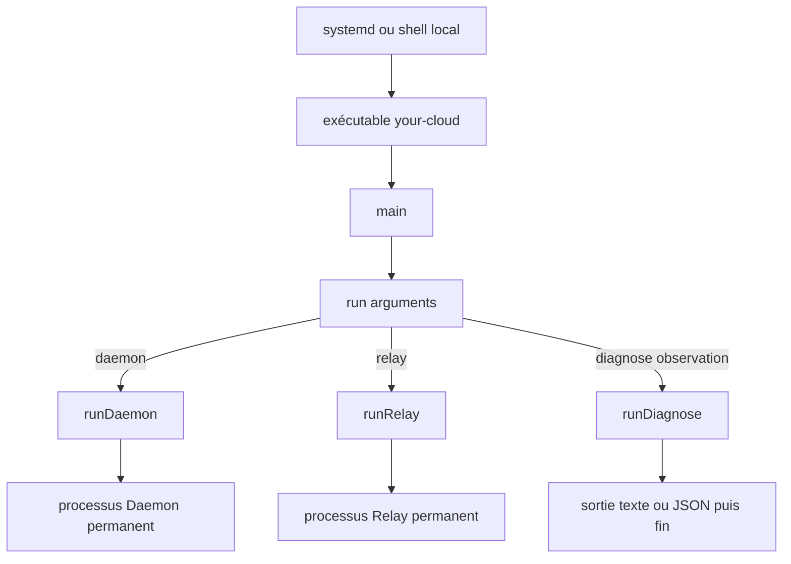
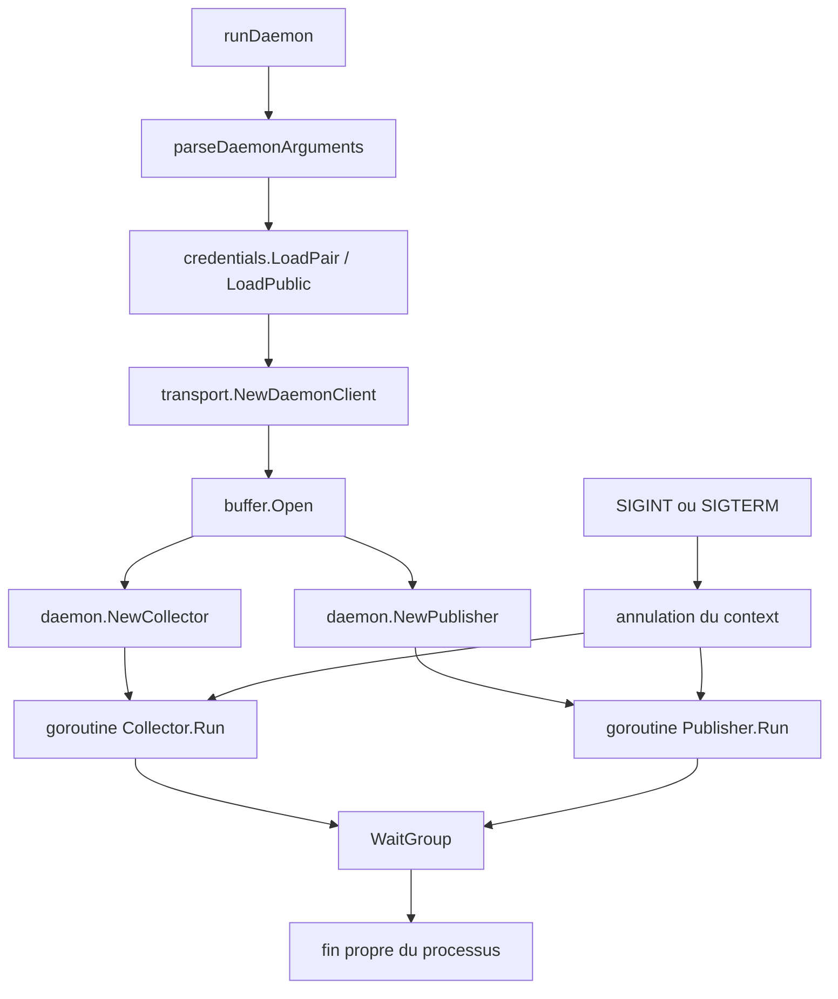
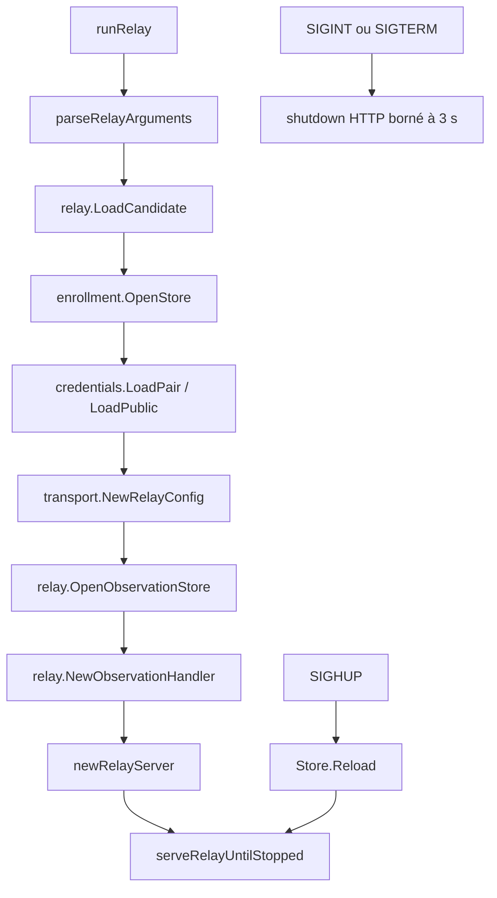
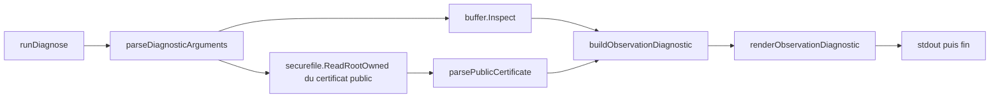
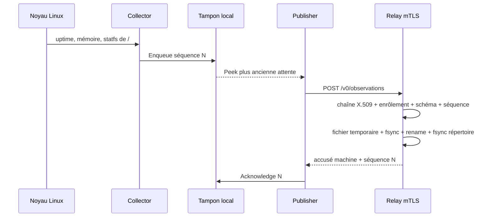

# Chaîne d'observation — carte technique de `v0.0.2`

> Statut : guide d'architecture vivant. `v0.0.2` est implémentée et prouvée
> dans le LAB. Ce document explique où le code s'exécute, qui appelle quoi,
> quelles données circulent et quelles limites restent ouvertes.

Une [édition HTML autonome et visuelle](../html/chaine-observation.html)
accompagne cette source canonique.

## Pourquoi cette carte existe

Une fonction peut être courte et correcte tout en restant difficile à replacer
dans le produit. Cette carte complète donc le code avec les questions de cycle
de vie :

- qui lance le binaire et avec quel rôle ;
- quelle fonction assemble chaque processus ;
- quels packages portent la logique métier ;
- où vivent les certificats, les états et les limites ;
- quels algorithmes sont utilisés et pourquoi ;
- quelles parties appartiennent encore à `v0.0.1` sans être appelées par le
  chemin courant.

## Les notions avant les appels

- L'**Agent** est l'installation locale de Your Cloud. Ce n'est pas un
  processus supplémentaire.
- L'**artefact** est le fichier exécutable unique `your-cloud`.
- Un **rôle** est choisi au lancement : `daemon`, `relay` ou `diagnose`.
- Un **processus** est une exécution en mémoire de l'artefact. Deux rôles lancés
  séparément restent deux processus indépendants.
- Une **goroutine** est une fonction exécutée concurremment dans le même
  processus Go. Elle ne crée ni VM, ni service, ni worker d'automatisation.
- Un **collecteur** lit une source locale fixe et produit une donnée typée.
- Une **observation** est l'enveloppe JSON versionnée qui regroupe les trois
  résultats `host-health.v1`.
- Le **tampon** conserve localement les observations non encore accusées.
- Une **lacune** décrit explicitement les séquences supprimées lorsque le
  tampon atteint une limite.
- Le **diagnostic** est une commande ponctuelle en lecture seule. Ce n'est pas
  une unité systemd et elle n'ouvre aucun port.

<!-- coherence: AGENT-AUTHORITY:start -->
## Placement réellement exécuté

```text
lab-console
|- go test / go vet / go build
|- génération des deux CA synthétiques pendant la preuve
`- aucun processus produit permanent

lab-machine-1                         lab-coordinateur
/usr/local/lib/your-cloud/your-cloud  /usr/local/lib/your-cloud/your-cloud
`- processus daemon                  |- processus daemon
    `- aucune écoute entrante        |   `- mTLS local vers le Relay
                                     `- processus relay
                                           `- écoute mTLS :8443
```

Les mêmes octets sont installés sur les deux machines. Sur
`lab-coordinateur`, systemd lance deux unités, donc deux processus, comptes
dynamiques, jeux de credentials et répertoires d'état distincts. Le rôle Relay
reste refusé sans manifeste candidat root-owned.

Le Daemon et le Relay partagent l'artefact, pas leur autorité :

| Rôle | Peut lire | Peut modifier | Réseau |
|---|---|---|---|
| Daemon | son certificat, sa clé, la CA Relay et les trois sources système fixes | son tampon sous `/var/lib/private/your-cloud-daemon` | HTTPS sortant vers l'origine Relay exacte |
| Relay | son certificat, sa clé, la CA Daemon, le registre et le manifeste candidat | son état sous `/var/lib/private/your-cloud-relay` | écoute TLS exacte sur `192.168.242.103:8443` |
| Diagnose | lancé ponctuellement par `root`, certificat public Daemon et état local déjà produit | rien | aucun accès réseau |

## Du système à la fonction Go



[`cmd/your-cloud/main.go`](../../cmd/your-cloud/main.go) est le seul sélecteur
de rôle. `main()` transmet `os.Args[1:]` à `run()`. `run()` refuse un rôle
inconnu, puis appelle exactement l'une des trois fonctions d'assemblage.

Le dossier `cmd/` est donc la **couture** du programme : il relie arguments,
credentials, stockage, réseau et arrêt propre. La logique détaillée reste dans
`internal/` afin d'être testable sans démarrer le processus complet.

## Chemin `daemon`

L'unité [`your-cloud-daemon.service`](../../deploy/v0.0.2/your-cloud-daemon.service)
lance :

```text
your-cloud daemon
  --machine-id=<identité fixée par l'installation>
  --relay-url=https://relay.v0-0-2.your-cloud.test:8443
```

`runDaemon` ne récupère pas toute sa configuration dans l'environnement :

- `machine-id` et `relay-url` sont des arguments de commande produits par
  systemd ;
- seul `CREDENTIALS_DIRECTORY` vient de l'environnement créé par
  `LoadCredential=` afin de localiser les copies privées temporaires des
  credentials systemd.



Les deux « workers » sont seulement deux goroutines du même Daemon :

1. **Collector** : collecte immédiatement, puis toutes les trente secondes. Il
   lit `/proc/uptime`, `/proc/meminfo` et les statistiques de `/`, construit
   une observation et la persiste dans le tampon.
2. **Publisher** : lit la plus ancienne observation en attente, l'envoie au
   Relay, vérifie l'accusé exact puis la retire. Si le Relay est indisponible,
   il conserve le tampon et applique un backoff borné.

Cette séparation permet à la collecte de continuer pendant une panne Relay.
Le `context` commun demande l'arrêt aux deux goroutines ; le `WaitGroup` attend
qu'elles aient réellement terminé avant que `runDaemon` retourne.

## Chemin `relay`

L'unité [`your-cloud-relay.service`](../../deploy/v0.0.2/your-cloud-relay.service)
lance le rôle uniquement sur la candidate :

```text
your-cloud relay --listen=192.168.242.103:8443
```



L'ordre est une frontière de sécurité : adresse, candidature, enrôlement,
credentials et stockage sont validés avant l'ouverture du socket. Le callback
d'autorisation est appliqué pendant la négociation TLS et à chaque requête ;
une révocation rechargée ne dépend donc pas d'une nouvelle connexion.

Le Relay expose uniquement `POST /v0/observations`. Il ne possède ni route de
lecture, ni route d'enrôlement, ni réponse contenant un ordre pour le Daemon.

## Chemin `diagnose`

La commande est appelée manuellement par `root` sur la machine concernée :

```text
your-cloud diagnose observation
your-cloud diagnose observation --format=json
```



Le privilège administratif sert uniquement à lire le tampon protégé du compte
dynamique sous `/var/lib/private`. Le diagnostic ne transforme pas le Daemon en
processus root, ne devient pas une unité systemd et ne reçoit aucune autorité
réseau.

Son rôle est d'expliquer l'état local du Daemon sans dépendre du Relay :
identité, version, profil, endpoint fixe, expiration du certificat, dernière
collecte, dernière livraison, état `available` ou `unavailable`, taille des
enveloppes en attente, prochaine séquence et nombre de lacunes.

`buffer.Inspect` lit sans créer, réordonner, purger ou réécrire. La commande
refuse un chemin, un sujet ou un format libre. Elle ne montre ni clé privée ni
valeurs de santé collectées.

<!-- coherence: AGENT-AUTHORITY:end -->

<!-- coherence: V1-APP-ACCESS:start -->
## Invariant Controller–Relay décidé — contrat `v0.0.3` en cadrage

La séparation des responsabilités et le sens de lecture ci-dessous sont des
invariants validés. Le protocole, les identités, les bornes et la reprise restent
à approuver dans le contrat du prochain palier avant toute implémentation.

`v0.0.2` s'arrête volontairement au stockage Relay. Le processus actif expose
uniquement `POST /v0/observations` aux Daemons : aucune route ne permet encore à
un Controller de lire cet état. Cette absence est une limite réelle du palier,
pas une invitation à laisser la Console appeler le Relay.

Le listener TLS actuel est lui aussi réservé aux Daemons : il fait confiance à
l'autorité cliente des Daemons et exige leur enrôlement dès la connexion. Ajouter
simplement une route Controller sur ce listener mélangerait donc deux classes
d'identité. Le prochain contrat doit créer une frontière de lecture distincte ou
prouver une séparation équivalente.

Le prochain incrément de lecture doit respecter ce trajet :

```text
Daemon -- POST mTLS --> Relay
   `- aucune connaissance du Controller

Controller -- requête privée authentifiée --> Relay
Controller <-- dernier état validé, séquence et lacunes -- Relay
Controller -- API privée authentifiée --> Console installée
```

Le Controller initie la lecture. Le Relay n'a donc pas besoin de connaître son
emplacement réseau. Il doit toutefois refuser toute identité de lecteur non
autorisée et valider la méthode, la route, la portée infrastructure ou machine,
le schéma, la cohérence et les tailles de la requête et de la réponse. Une
Console installée contacte ses Controllers approuvés, jamais le Relay. Aucun
Controller ne lui fournit son frontend ou son code exécutable. Un Controller
porte l'autorité d'une seule infrastructure ; une Console peut conserver
plusieurs associations indépendantes.

| Sujet | Relay | Controller |
|---|---|---|
| Enrôlement machine | applique le registre d'autorisation local provisionné par root et refuse immédiatement | porte à terme la décision métier et l'inventaire de référence |
| Réception | authentifie le Daemon, valide le schéma et persiste avant accusé | relit sans faire confiance aveuglément à la donnée reçue |
| Séquence et lacune | contrôle et conserve le dernier fait d'observation validé | interprète l'impact et fournit l'état métier à la Console |
| Fraîcheur | fournit l'heure locale de réception de l'hôte Relay | traite la dérive d'horloge et décide des seuils `récent`, `ancien` ou `absent` |
| Utilisateurs et rôles | aucun | authentifie l'humain et autorise la consultation ou l'action |
| Plans et exécution | aucun | prépare le plan puis utilise un chemin d'action distinct |

Pour le premier Controller en lecture seule, l'enrôlement reste provisionné
manuellement comme dans `v0.0.2`. Le tableau fixe la future source d'autorité ;
il ne décide ni d'une synchronisation du registre, ni d'une mutation pendant le
prochain incrément. L'autorité qui émettra les certificats Controller, leur
placement et leur révocation cryptographique restent à choisir ; ils ne se
déduisent pas de l'inventaire métier.

L'accusé actuel signifie seulement « la séquence exacte est durable sur le
Relay ». Il autorise le Daemon à retirer cette attente ; il ne prouve ni que le
Controller l'a lue, ni qu'un utilisateur l'a vue. Le Relay conserve le dernier
état accepté par machine, pas un historique de séries temporelles. Une rétention
historique ou un accusé de bout en bout demanderait donc un autre contrat.

La première lecture est par conséquent un instantané. Si les séquences 10, 11 et
12 sont acceptées entre deux lectures du Controller, celui-ci peut ne recevoir
que 12. Ce remplacement n'est pas une `Lacune d'observation` : ce terme désigne
uniquement un intervalle supprimé du tampon borné du Daemon. Une livraison
exhaustive ou une série temporelle exigerait un stockage et un protocole
différents.

La fraîcheur ne peut pas reposer uniquement sur `observed_at`, déclaré par
l'horloge de la machine observée. Le Controller doit partir de l'heure locale de
réception du Relay et le prochain contrat doit fixer comment détecter ou borner
la dérive entre les horloges Relay et Controller.

Relay et Controller peuvent cohabiter sur une petite infrastructure, mais ils
doivent rester des processus, comptes, identités, stockages et politiques
d'accès séparés ; la frontière réseau exacte reste à contracter. Leur cohabitation
partage malgré tout la zone de compromission root de l'hôte. Un placement plus
exposé du Relay ne doit donc pas entraîner le Controller dans la même zone sans
accepter explicitement ce risque.

La compromission root de l'hôte Relay permet de lire ou d'altérer son état après
terminaison TLS. Une signature de bout en bout pourrait rendre une altération
détectable par le Controller, mais ne cacherait pas les données au Relay ;
intégrité, authenticité et confidentialité de bout en bout restent donc trois
questions distinctes, hors de `v0.0.2`.

Avant le code de l'incrément Console–Controller, le contrat doit encore fixer le
format et la chaîne de distribution signée de la Console, son stockage sécurisé,
les identités d'appareil et humaines, les sessions, l'API Controller, puis le
protocole de lecture Relay, sa frontière réseau, l'autorité de certificats,
l'identité du Controller, les méthodes, routes et portées, les schémas et
bornes, la stratégie d'horloge, la sémantique d'instantané et la reprise après
indisponibilité. Le Controller initial reste en lecture seule : aucun SSH,
Ansible, plan appliqué, SSO obligatoire, session utilisateur publique ou canal
d'action n'est ajouté au Relay.
<!-- coherence: V1-APP-ACCESS:end -->

<!-- coherence: V1-OBSERVATION:start -->
## Trajet d'une observation



Une observation contient exactement : version de schéma, identité machine,
version Daemon, profil, séquence persistante, heure de collecte, résultats des
trois collecteurs et éventuelles lacunes.

Le Relay accuse seulement après publication durable. Un accusé erroné ne
retire rien du tampon. Un rejeu octet pour octet est idempotent ; la même
séquence avec d'autres octets est une collision refusée.

## États et fichiers persistants

| Fichier logique | Responsable | Contenu | Écriture |
|---|---|---|---|
| `observation-buffer.json` | Daemon | état courant, attente ordonnée, prochaine séquence, lacunes, livraison | temporaire `0600`, `fsync`, renommage atomique, `fsync` du répertoire |
| `relay-observations.json` | Relay | dernier état durable et lacunes cumulées par machine | même protocole atomique |
| `enrollment.json` | root, lu par Relay | machine, URI SAN, série, SHA-256 du certificat, état | provisionnement manuel puis reload explicite |
| `relay-candidate.json` | root, lu par Relay | autorisation locale du seul rôle Relay | provisionnement manuel |

Les limites d'exploitation du tampon sont 64 KiB, 120 observations et une
heure, première atteinte. Les plus anciennes attentes partent d'abord ; l'état
courant reste disponible et l'intervalle supprimé devient une lacune.

La limite en octets porte sur le fichier d'état complet. Le champ de diagnostic
`pending_bytes` additionne seulement les enveloppes encore en attente : il vaut
zéro lorsque la file est vide, même si le fichier durable garde ses métadonnées
et son état courant.

## Carte des packages

| Emplacement | Responsabilité actuelle | Appelé par |
|---|---|---|
| `cmd/your-cloud/main.go` | sélection stricte du rôle | système d'exploitation |
| `cmd/your-cloud/daemon.go` | assemblage et durée de vie du Daemon | `run()` |
| `cmd/your-cloud/relay.go` | assemblage, signaux et serveur Relay | `run()` |
| `cmd/your-cloud/diagnose.go` | lecture et rendu ponctuels | `run()` |
| `internal/observation` | schéma, validation et trois collecteurs | Collector, Buffer, Relay |
| `internal/buffer` | file locale bornée, séquences, lacunes et diagnostic | Daemon, Diagnose |
| `internal/daemon/observer.go` | boucles Collector et Publisher | `runDaemon` |
| `internal/transport` | politiques TLS 1.3 client et serveur | Daemon, Relay |
| `internal/enrollment` | registre, empreinte et révocation rechargeable | Relay |
| `internal/relay/observation_http.go` | frontière HTTP d'écriture | `runRelay` |
| `internal/relay/observation_store.go` | persistance, rejeu, collision et lacunes | handler Relay |
| `internal/credentials` | lecture bornée des noms systemd fixes | Daemon, Relay |
| `internal/securefile` | lecture root-owned sans suivre de lien | candidature, enrôlement, diagnostic |
| `internal/strictjson` | refus des noms non canoniques, champs inconnus, doublons et valeurs multiples | schémas persistés et réseau |
| `internal/machineid` | syntaxe commune d'identité | présence historique et observation |

### Index d'appel du palier

Ce tableau sert de point d'entrée quand un nom apparaît dans le code sans que
son moment d'exécution soit encore évident. Il couvre les contrats qui portent
le comportement de `v0.0.2` ; les petites fonctions de parsing ou de formatage
restent auprès de leur appelant dans le fichier concerné.

| Fonction ou méthode | Appelée par | Quand | Effet ou décision |
|---|---|---|---|
| `main` puis `run` | système d'exploitation | une fois par invocation | sélectionne un seul rôle et transforme toute erreur finale en code de sortie `2` |
| `runDaemon` | `run` | démarrage du service Daemon | charge l'identité, construit transport et tampon, puis lance Collector et Publisher |
| `Collector.Run` | goroutine créée par `runDaemon` | immédiatement puis toutes les 30 s | cadence la collecte jusqu'à l'annulation |
| `Collector.CollectOnce` | `Collector.Run` | à chaque cadence | appelle `CollectHostHealth`, puis `Buffer.Enqueue` |
| `observation.CollectHostHealth` | Collector | à chaque collecte | lit uniquement les trois sources fixes et transforme une erreur locale en code borné |
| `Buffer.Open` | `runDaemon` | avant les goroutines | crée ou valide l'état durable, reprend séquences, attentes et lacunes |
| `Buffer.Enqueue` | Collector | après chaque collecte | prépare une observation candidate, applique les limites puis la publie durablement |
| `Publisher.Run` | seconde goroutine de `runDaemon` | pendant toute la vie du Daemon | réessaie avec backoff et journalise seulement les transitions de disponibilité |
| `Publisher.SendOnce` | `Publisher.Run` | tant qu'une attente existe | `Peek`, POST mTLS, validation de l'accusé, puis `Acknowledge` exact |
| `Buffer.Peek` / `Acknowledge` | Publisher | avant / après un accusé valide | expose l'attente la plus ancienne, attache une lacune, puis retire uniquement la bonne séquence |
| `Buffer.SetDeliveryState` | Publisher | panne ou reprise | persiste `available` ou `unavailable`, sans texte d'erreur libre |
| `runRelay` | `run` | démarrage du service Relay | refuse d'abord adresse, candidature, registre et credentials, puis ouvre HTTPS |
| `enrollment.Authorize` | handshake TLS et handler HTTP | connexion puis chaque POST | associe certificat exact, URI SAN et machine active ; une révocation reste effective sur une connexion réutilisée |
| `enrollment.Reload` | `serveRelayUntilStopped` | réception de `SIGHUP` | remplace la politique seulement si le nouveau registre entier est valide |
| `ObservationHandler.ServeHTTP` | serveur HTTPS | chaque requête | borne méthode, chemin, query, type, taille, certificat et schéma avant stockage |
| `ObservationStore.Save` | handler Relay | après authentification | contrôle identité, séquence, lacunes, rejeu ou collision, puis publie l'état durable avant accusé |
| `runDiagnose` | `run` | commande administrative locale ponctuelle, en `root` | appelle `Buffer.Inspect`, lit le certificat public et rend une synthèse bornée |
| `strictjson.Decode` | frontières réseau et fichiers d'état | à chaque décodage concerné | refuse doublons, noms non canoniques, champs inconnus et seconde valeur |
| `securefile.ReadRootOwned` | candidature, enrôlement, diagnostic | avant de faire confiance à un fichier root | refuse chemin non canonique, lien, propriétaire ou mode dangereux et taille excessive |

### Code historique `v0.0.1`

`internal/presence`, `internal/daemon/daemon.go`, `internal/relay/http.go` et
`internal/relay/store.go` conservent le contrat et les tests de présence
`v0.0.1`. Le chemin `cmd/your-cloud` de `v0.0.2` ne les assemble plus : il
utilise `observer.go`, `observation_http.go` et `observation_store.go`.

Cette coexistence rend encore la preuve historique relisible. Elle ne signifie
pas que deux protocoles sont actifs simultanément. Leur retrait ou migration
sera une décision de distribution explicite, pas un nettoyage opportuniste. En
particulier, `QUERY /v0/machines` et le calcul `recent`/`old`/`absent` de
`v0.0.1` ne définissent pas la lecture du prochain Controller : l'inventaire et
la politique de fraîcheur appartiennent au Controller, tandis que le nouveau
contrat Relay reste à borner.

## Pourquoi deux dossiers dans `deploy/`

`deploy/v0.0.1` et `deploy/v0.0.2` sont des recettes reproductibles de deux
contrats différents, pas deux installations actives en parallèle :

| Palier | Transport et données | Credentials | État |
|---|---|---|---|
| `v0.0.1` | présence HTTP LAB | aucun certificat | présence Relay en mémoire |
| `v0.0.2` | observations HTTPS mTLS | identité Daemon, identité Relay et CA séparées | tampon Daemon et stockage Relay durables |

Réutiliser les scripts `v0.0.1` aurait imposé des branches conditionnelles
entre deux formats, deux modèles de secrets et deux preuves de retrait. Les
dossiers versionnés permettent de rejouer exactement un palier et d'expliquer
sa migration. Une future enveloppe de distribution pourra factoriser le cycle
commun lorsqu'elle possédera son propre contrat ; `v0.0.2` ne l'anticipe pas.

## Cryptographie et algorithmes

Your Cloud n'implémente aucune primitive cryptographique maison.

| Mécanisme | Où | Utilité | Ne garantit pas |
|---|---|---|---|
| TLS 1.3 standard Go | `internal/transport` | confidentialité et intégrité du trajet, authentification mutuelle | véracité d'une machine compromise |
| X.509 avec signatures Ed25519 | PKI synthétique du LAB | séparer les autorités Relay et Daemon, accepter exactement une CA et un usage `serverAuth` ou `clientAuth` | PKI de production ou renouvellement automatique |
| URI SAN `urn:your-cloud:daemon:<id>` | certificat Daemon et enrôlement | porter l'identité sans se fier au Common Name | autorisation si le certificat n'est pas enregistré |
| SHA-256 du certificat | `internal/enrollment` | épingler exactement la feuille enrôlée | secret ou preuve de possession à lui seul |
| SHA-256 du message | stockage Relay | reconnaître un rejeu identique et une collision | chiffrement du message stocké |
| comparaison en temps constant | empreinte d'enrôlement | éviter une comparaison octet par octet à arrêt précoce | protection d'un hôte déjà compromis |
| backoff exponentiel borné | Publisher | éviter une boucle réseau agressive pendant une panne | livraison si la panne dépasse le tampon |
| séquence croissante + fusion de lacunes | Buffer et Relay | ordre visible et pertes explicites | reconstruction des observations supprimées |
| écriture temporaire + `fsync` + rename | Buffer et Relay | état ancien ou nouveau après crash, pas un fichier partiel annoncé | survie à toute panne matérielle imaginable |

## Petit guide de lecture Go

### `:=`

```go
client, err := transport.NewDaemonClient(...)
```

`:=` déclare des variables locales et leur donne immédiatement une valeur. Ici
Go déduit les types de `client` et `err`. Plus tard, `=` modifie une variable
déjà déclarée.

### La garde d'erreur immédiate

```go
if err != nil {
    return fmt.Errorf("daemon transport: %w", err)
}
```

Go utilise des erreurs retournées plutôt que des exceptions implicites. La
fonction arrête tôt le chemin invalide ; le chemin nominal reste ensuite
lisible de haut en bas. `%w` ajoute du contexte tout en conservant l'erreur
d'origine.

Cette forme compacte déclare puis vérifie une erreur dans le même bloc :

```go
if err := buffer.persist(); err != nil {
    return err
}
```

La variable `err` n'existe que dans ce `if`. Ce n'est pas une erreur ignorée ;
c'est une portée volontairement courte.

### `defer`

```go
defer response.Body.Close()
```

`defer` planifie l'appel juste avant la sortie de la fonction, quel que soit le
retour emprunté. Il sert ici à toujours libérer la ressource.

### `&`, `*` et `nil`

`&configuration.machineID` donne au package `flag` l'adresse du champ à
remplir. Dans un type comme `*Buffer`, l'étoile indique un pointeur vers la même
instance plutôt qu'une copie. `nil` signifie qu'un pointeur, une map, une slice,
un canal, une interface ou une fonction ne désigne encore aucune valeur.

### Méthodes et pointeurs

```go
func (buffer *Buffer) Acknowledge(sequence uint64, deliveredAt time.Time) error
```

`(buffer *Buffer)` signifie que la fonction est une méthode de `Buffer` et peut
modifier cette instance. Un récepteur sans `*` travaille sur une copie de la
valeur.

### `go`, `context` et `WaitGroup`

```go
go collector.Run(ctx)
```

`go` démarre la fonction concurremment dans le même processus. Le `context`
transporte l'annulation ; le `WaitGroup` compte les goroutines encore actives
et empêche le processus de sortir avant leur arrêt.

### Canaux et `select`

Un `chan error` transporte ici la fin du serveur HTTP depuis sa goroutine.
`select` attend le premier événement disponible : signal système, annulation,
fin d'un délai ou erreur serveur. Cette attente bloque sans boucle active.

### Majuscule initiale et tags JSON

En Go, `Save` ou `ObservationStore` avec une majuscule initiale est exporté et
peut être appelé depuis un autre package ; `gapsCover` reste privé au package.
Dans `` `json:"machine_id"` ``, le tag fixe le nom exact du champ sur le fil ;
`strictjson` refuse aussi les variantes de casse que le décodeur Go accepterait
sinon par tolérance.

### `io.EOF`

Dans le Publisher, `io.EOF` signifie « aucune observation en attente ». Ce
n'est pas une panne du Relay. Le code le distingue donc des erreurs réseau.

## Pannes et comportement attendu

| Événement | Comportement |
|---|---|
| Relay absent | collecte continue, état `unavailable`, backoff de 1 s à 1 min |
| tampon saturé | plus anciennes attentes supprimées, état courant conservé, lacune persistée |
| redémarrage Daemon | séquence, attente et lacunes relues avant reprise |
| redémarrage Relay | dernier état et lacunes durables relus |
| certificat inconnu ou révoqué | négociation ou requête refusée, aucun accusé |
| registre invalide au reload | ancienne politique valide conservée |
| accusé faux | observation maintenue localement |
| même séquence, mêmes octets | rejeu idempotent accepté |
| même séquence, autres octets | collision refusée |
| signal d'arrêt | arrêt coordonné des goroutines ou shutdown HTTP borné |

## Preuve et automatisation

La [preuve LAB `v0.0.2`](../lab/v0.0.2-observation.md) a réellement exécuté le
nominal, les certificats hostiles, la révocation, l'indisponibilité, la
saturation, la lacune, la reprise, les redémarrages, le retrait et la
réinstallation.

Le scénario multi-VM a été piloté étape par étape. Le prochain travail
d'automatisation éventuel consiste à encapsuler ces mêmes étapes dans une
commande reproductible avec verrou, échéances, nettoyage d'échec et résultat
structuré. Cela aiderait les revalidations locales et, plus tard, une CI munie
d'un runner libvirt dédié. Une CI GitHub standard sans ces VM ne peut pas
remplacer la preuve. Ce sujet reste noté ; il n'est pas implémenté dans ce
palier.

## Ce qui est prouvé et ce qui reste absent

| Niveau | Contenu |
|---|---|
| **Prouvé dans `v0.0.2`** | artefact commun ; processus isolés ; profil fixe ; mTLS ; enrôlement et révocation ; tampon et lacunes ; accusé durable ; diagnostic ; redémarrages et réinstallation |
| **Décidé plus tard dans la V1** | lecture privée du Relay par l'identité propre d'un Controller, politique de fraîcheur dans ce Controller et rendu par la Console |
| **Absent** | Console et Controller actuels ; API de lecture Relay ; Ansible métier ; canal d'action ; commande distante ; Auxiliaire ; WireGuard ; service OCI ; plugin libre ; scan LAN ; enrôlement en ligne ; renouvellement automatique ; failover ou élection Relay ; Proxmox ; OpenStack ; worker d'automatisation ; projet IaC |

## Limites de sécurité

- root peut remplacer les fichiers et contourner les protections locales ;
- une machine compromise peut mentir dans les champs qu'elle est autorisée à
  produire ;
- le Relay voit les observations en clair après terminaison TLS ;
- les autorités synthétiques de preuve ne sont pas une PKI de production ;
- le diagnostic local ne constitue pas une API de supervision ;
- une lacune rend une perte visible mais ne récupère pas les données ;
- les microbenchmarks du LAB ne sont pas des plafonds de production ;
- aucune propriété isolée ne suffit à déclarer une conformité OWASP ou NIS2.

Les listes positives, identités séparées, schémas stricts, sorties bornées et
refus par défaut appliquent moindre privilège, réduction de surface, séparation
des responsabilités et défense en profondeur. Ils contribuent aux mesures de
cryptographie, contrôle d'accès, continuité, développement sûr et mesure
d'efficacité de NIS2 sans constituer une déclaration de conformité.
<!-- coherence: V1-OBSERVATION:end -->

## Sources pour aller plus loin

- contrat : [`CONTRAT-V0.0.2.md`](../objectifs/v1/CONTRAT-V0.0.2.md) ;
- preuve exécutée : [`v0.0.2-observation.md`](../lab/v0.0.2-observation.md) ;
- contrôles et automatisation restante :
  [`TESTS.md`](../contribution/TESTS.md) ;
- placement global : [`ANATOMIE.md`](ANATOMIE.md) ;
- règles de code : [`QUALITE.md`](../contribution/QUALITE.md).
