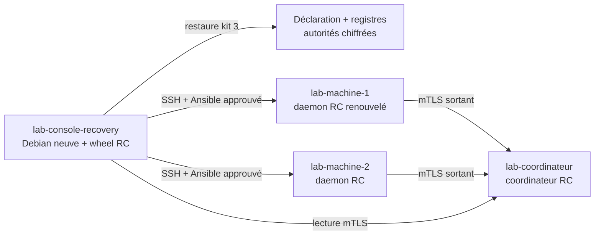

# Preuve LAB P6 — release V1 complète

> Preuve produite le 2026-07-12 dans la topologie `v1-full`. Tous les builds,
> tests, installations, playbooks, mesures et signatures ont été exécutés dans
> les VM LAB. Aucun composant du projet n'a été exécuté sur le laptop.

## Placement final



`labctl list` a confirmé six VM d'origine `your-cloud/labctl`, leurs gabarits,
la topologie et des adresses différentes de `192.168.122.123` et `10.66.66.1`.
`lab-console-recovery`, créée depuis son snapshot `clean`, possède son propre
volume et rejoint uniquement `lab-operator`.

## Restauration sur VM neuve

Le kit complet a été actualisé depuis l'état P5 puis transféré directement
entre les deux consoles LAB. Le mot de passe synthétique a été injecté seulement
pendant les commandes et supprimé ensuite. La VM neuve a restauré trois clés
d'administration chiffrées, les identités mTLS de rôle, la déclaration et les
registres, sans contacter ni réenrôler les machines.

Les deux infrastructures ont été retrouvées. Les deux lectures distantes ont
vérifié mTLS et les signatures Ed25519 aux séquences 156, puis un plan pilote a
donné `changed=0`. Une lecture sans mot de passe après suppression du fichier
temporaire a été refusée.

## Cycle de vie et identité

Les mouvements logiques P5 avaient déjà conservé identité et historique. P6 a
ajouté et prouvé :

- désaffectation et désenrôlement séparés de toute mutation distante ;
- désinstallation du seul observer sur `lab-machine-2` sous snapshot ;
- charge systemd synthétique indépendante restée active ;
- re-run de désinstallation `ok=4 changed=0` ;
- restauration du snapshot pour rendre la flotte intacte ;
- renouvellement en deux phases de `lab-machine-1`, candidate créée localement,
  rollback préparé, ancienne clé archivée et même machine logique conservée ;
- état direct signé à la séquence 172 puis retour du flux continu à la séquence
  177 après synchronisation du registre public du coordinateur.

L'ancienne identité est refusée comme remplacée. La nouvelle clé privée n'a
jamais quitté la machine.

## Mise à jour progressive

Le coordinateur a été mis à jour avant les daemons. `lab-machine-1` a servi de
pilote, puis `lab-machine-2` a reçu la même version exacte. Chaque remplacement
a vérifié le SHA-256 local, conservé `.previous`, redémarré uniquement le
composant ciblé et vérifié `version`.

Les re-runs finaux ont donné :

```text
coordinateur : ok=6 changed=0 failed=0
lab-machine-1 : ok=6 changed=0 failed=0
lab-machine-2 : ok=6 changed=0 failed=0
```

Une déclaration mensongère `1.0.0-rc.2` avec le checksum du binaire RC1 a été
refusée avec `changed=0`. Aucune propagation n'a suivi.

## Budgets mesurés

Les unités imposent `CPUQuota=25%`, `TasksMax=64`, `MemoryMax=64M` pour un
observer et `MemoryMax=128M` pour le coordinateur.

| Composant | Mémoire courante | Pic | Plafond | Tâches | SQLite |
|---|---:|---:|---:|---:|---:|
| coordinateur | 3 268 608 | 3 514 368 | 134 217 728 | 7/64 | 16 384 / 67 108 864 |
| observer machine 1 | 3 305 472 | 4 816 896 | 67 108 864 | 7/64 | 16 384 / 10 485 760 |
| observer machine 2 | 3 301 376 | 4 792 320 | 67 108 864 | 7/64 | 16 384 / 10 485 760 |

Les trois mesures ont rendu `budget respecté`.

## Artefacts RC signés

`tools/build-release` a exécuté les tests Go, construit avec `-trimpath -s -w`,
créé le wheel sans résolution de dépendances, produit `SHA256SUMS`, signé ce
manifeste en Ed25519 avec une clé synthétique LAB puis revérifié signature et
sommes.

| Artefact | SHA-256 |
|---|---|
| console wheel | `1e8711c99d031af7a859b8dce952f4dcf115e6515335a3990201e99d8e3e37ba` |
| engine Ansible | `4b3003f6f0802f1c5a778c5262ab4df61826dcda29c26a8f48b72c49a6708dad` |
| coordinateur amd64 | `299abba53d227f9d2f8d592ef3ba9df70024886e95a1e1d230ea9d8e7e9755f2` |
| observer amd64 | `dd215334810f648b48ba847a5a8b75ce2d674589b4df7d0a42aaa2819d003323` |

La flotte finale exécute ces deux binaires exacts. Le lot local fait environ
23 Mio et contient aussi les unités, métadonnées, signature et clé publique de
preuve. Il n'a pas été publié comme release réelle.

## Parcours débutant et avancé

Sur la console neuve, le premier essai a révélé l'absence de `ensurepip` dans
l'image Debian. L'installation exacte de
`python3.13-venv=3.13.5-2+deb13u3` a fermé l'écart. Un venv neuf a ensuite
installé le wheel RC et ses dépendances épinglées, créé une déclaration et une
première infrastructure, puis affiché la CLI.

Les lectures finales du lot exact ont atteint les séquences 193 et 194. Le
parcours avancé a restauré la flotte P5, renouvelé une identité, mis à jour
progressivement trois composants, mesuré leurs budgets, désinstallé un daemon
sous snapshot et vérifié les artefacts. Les preuves P1 à P5 restent les étapes
réelles du parcours initial depuis machines Debian nues.

## Validations et frontière de publication

La validation finale comprend tous les tests Go, les tests Python, les
`syntax-check` Ansible, les liens documentaires, les plans négatifs et les
re-runs idempotents. Aucun secret réel n'a été utilisé ou affiché.

P6 autorise désormais la préparation d'une publication. Le tag `v1.0.0`, le
push de `main` et toute release restent interdits sans GO explicite de Lucas
nommant exactement la référence.
