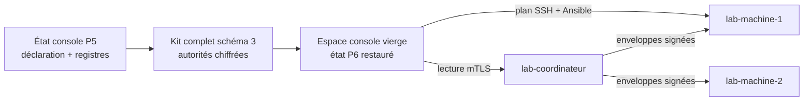

# Preuve intermédiaire P6 — restauration de la console

> Preuve produite le 2026-07-12 dans `lab-console`, topologie `v1-full`,
> depuis l'état P5 conservé. Cette preuve utilise un espace console vierge sur
> la VM existante ; la recréation depuis une nouvelle VM Debian reste à faire.

## Cibles et garde préalable

`tools/labctl list` a confirmé avant mutation les cinq VM d'origine
`your-cloud/labctl`, leurs gabarits `v1-full` et les mêmes adresses que P5.
Aucune ne correspond à `192.168.122.123` ou `10.66.66.1`.

Seuls le kit et le mot de passe synthétiques P5 ont été utilisés. Le kit source
a été conservé : une copie privée en mode `0600` a servi à l'actualisation P6.
Aucune valeur de secret, clé ou certificat privé n'a été affichée.

## Placement de la preuve



Le kit complet contient trois clés d'administration chiffrées, l'autorité et
les identités de rôle mTLS chiffrées, la déclaration, les clés d'hôte SSH et le
registre public des identités de télémétrie. Les clés privées de télémétrie des
daemons restent sur leurs machines.

## Plans et refus avant approbation

Les commandes `recovery refresh` et `recovery restore` ont d'abord été lancées
sans `--approve`. Elles ont retourné le code métier `3`. Les SHA-256 du kit et
des destinations ont confirmé qu'aucune écriture n'avait eu lieu.

La restauration approuvée a ensuite annoncé :

```text
Kit complet actualisé : 3 clé(s) d'administration chiffrée(s).
Console restaurée : 3 clé(s) d'administration, déclaration et registre
d'identités vérifiés. Aucun réenrôlement effectué.
```

Les SHA-256 de la déclaration, du registre de clés d'hôte SSH et du registre
d'identités étaient identiques entre la source P5 et l'état restauré.

## Reprise de la flotte existante

Depuis les seuls chemins restaurés, la console a retrouvé `site-a` et `site-b`,
chacun avec une machine et le domaine déclaré `lab-site-private`. Elle a ensuite
lu le coordinateur public avec l'identité mTLS restaurée et revérifié les deux
signatures Ed25519 d'origine :

```text
Machine : lab-machine-1
Provenance : coordinateur-mtls + signature-ed25519-verified
État : recent (séquence 145)

Machine : lab-machine-2
Provenance : coordinateur-mtls + signature-ed25519-verified
État : recent (séquence 145)
```

## Plan idempotent sans réenrôlement

La console restaurée a présenté puis appliqué le plan de coordination existant
sur `lab-machine-1`. Le playbook a exécuté son `--syntax-check` interne, puis
l'application et son re-run ont tous deux donné :

```text
ok=7 changed=0 unreachable=0 failed=0 skipped=0 rescued=0 ignored=0
```

Le daemon n'a pas été réenrôlé et aucun service applicatif n'a été touché.

## Validations et limite

Avec les dépendances Python épinglées installées dans un venv temporaire de
`lab-console`, les 36 tests de la console ont réussi. L'horloge de la VM avait
un décalage d'environ vingt secondes avec le laptop ; cela n'a affecté ni les
validations cryptographiques ni les résultats.

Cette preuve ferme le chemin logiciel d'actualisation et de restauration, la
reprise mTLS, la consultation des deux infrastructures et l'idempotence depuis
un état neuf. Elle ne ferme pas encore la preuve de sortie P6 : une VM console
réellement neuve doit reproduire le parcours, puis les renouvellements,
mises à jour, budgets de ressources et artefacts de release restent à prouver.
