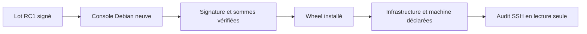

# Essai d'adoption de `v1.0.0-rc.1`

> Essai mené le 2026-07-12 dans `lab-console-recovery`, revenue à son
> snapshot Debian `clean`. L'état P6 précédent a d'abord été conservé dans le
> snapshot `pre-rc1-adoption`. Aucun composant n'a été exécuté sur le laptop.

## Question posée

Un utilisateur qui ne possède que le lot distribuable et la documentation
d'installation peut-il obtenir le premier bénéfice du produit sans consulter
le dépôt source ?

## Ce qui fonctionne

- les six VM ont été confirmées par `labctl list` avec l'origine
  `your-cloud/labctl`, leurs gabarits `v1-full` et des adresses différentes de
  `192.168.122.123` et `10.66.66.1` ;
- le lot `p6-release-rc1-colocated` correspond aux sommes publiées dans la
  preuve P6 ;
- OpenSSL a rendu `Signature Verified Successfully` et chaque entrée de
  `SHA256SUMS` a rendu `OK` ;
- `python3.13-venv=3.13.5-2+deb13u3` s'installe sur Debian 13 après préparation
  du réseau LAB ;
- le wheel et ses dépendances Python épinglées s'installent dans un venv neuf ;
- `your-cloud --help`, `init`, `infrastructure add` et `machine add`
  fonctionnent depuis le seul wheel distribué.

## Écarts trouvés

La documentation RC1 ne fournit pas de parcours minimal complet. L'aide de la
CLI expose les options mais n'explique ni l'origine du premier accès SSH ni la
suite attendue entre déclaration, audit et enrôlement.

Le lot RC1 installe correctement la lecture seule, mais les commandes de
mutation ont besoin d'Ansible. Le document demandait alors
`console/requirements-lab.txt`, fichier absent du lot distribuable. Un
utilisateur sans dépôt source ne pouvait donc pas installer de manière prouvée
les dépendances nécessaires à l'enrôlement.

L'audit final n'a pas été contourné lorsque la machine sécurisée a refusé une
nouvelle clé SSH injectée hors du parcours produit. La copie de la clé privée
du contrôleur LAB dans la console a également été refusée : une preuve
d'adoption ne doit pas affaiblir la séparation des autorités pour devenir verte.

## Décision pour la candidate suivante

`v1.0.0-rc.1` reste la preuve de construction P6, mais n'est pas promue en
`v1.0.0`. La candidate suivante doit :

- embarquer un extra Python `automation` avec les dépendances Ansible
  épinglées ;
- documenter le premier audit, y compris l'origine nécessaire de l'accès SSH ;
- reproduire ce parcours depuis une VM neuve et une cible possédant déjà un
  accès utilisateur légitime ;
- n'être promue qu'après installation, audit puis enrôlement depuis le seul
  lot distribué.
