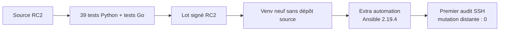

# Preuve intermédiaire d'adoption de `v1.0.0-rc.2`

> Preuve produite le 2026-07-12 dans `lab-console` et
> `lab-console-recovery`. La candidate a été construite et signée avec une clé
> synthétique dans le LAB, puis installée depuis son seul lot sur la console
> revenue à Debian `clean`. Aucun composant n'a été exécuté sur le laptop.

## Ce que RC2 corrige

L'essai RC1 avait montré qu'un utilisateur pouvait installer la console en
lecture seule, mais pas ses dépendances Ansible sans récupérer un fichier dans
le dépôt source. RC2 ajoute au wheel un extra `automation` entièrement épinglé
et documente l'origine nécessaire du premier accès SSH.



## Construction et cohérence du lot

`tools/build-release` exécute désormais les tests Python avant les tests Go. Il
refuse aussi un daemon, un coordinateur ou un wheel dont la version interne ne
correspond pas au nom demandé. Le build final a produit :

```text
Ran 39 tests in 3.802s
OK
tests Go : OK
Signature Verified Successfully
Release candidate 1.0.0-rc.2 construite et vérifiée
```

| Artefact | SHA-256 |
|---|---|
| console wheel | `890d791bddab79005011431c31196ea3e7862320ffbba73d1c4aab30bcbcb14f` |
| engine Ansible | `4b3003f6f0802f1c5a778c5262ab4df61826dcda29c26a8f48b72c49a6708dad` |
| coordinateur amd64 | `2e92d7024921c3cf57cc7713d2d2f8af44ffa052b5bc0e06805b8dad28ade9e0` |
| observer amd64 | `eb4793f06f25f90c9f957f83c08ffa88ed64409f77965752257632bfa1b2fbfe` |

## Installation depuis le seul lot

La console neuve a revérifié la signature et toutes les sommes, puis cette
installation a résolu uniquement les versions portées par le wheel :

```text
pip install './your_cloud_console-1.0.0rc2-py3-none-any.whl[automation]'
Successfully installed ... ansible-core-2.19.4 ... your-cloud-console-1.0.0rc2
ansible-playbook [core 2.19.4]
```

Aucun fichier du dépôt source n'a été nécessaire sur cette console.

## Premier bénéfice utilisateur

Une déclaration et une infrastructure neuves ont été créées depuis la CLI
installée. Pour ne pas copier la clé privée du contrôleur LAB ni affaiblir une
machine déjà sécurisée, le premier audit a ciblé la console LAB elle-même avec
une identité SSH synthétique locale.

Le résultat a confirmé Debian 13 amd64, systemd, l'accès `sudo`, l'espace
disque, les sources de configuration et les sockets. La décision vaut
`eligible`, sans refus ni conflit, avec `Mutation distante : 0`. La clé d'hôte
a été enregistrée comme `tofu-visible`.

## Limite avant promotion stable

Cette preuve ferme l'installation autonome et le premier audit, mais elle ne
prétend pas simuler un utilisateur extérieur complet. Avant `v1.0.0`, une cible
Debian distante neuve doit être provisionnée avec une clé appartenant dès le
départ à l'opérateur. Depuis le seul lot RC2, celui-ci doit alors reproduire :

1. l'audit distant sans mutation ;
2. le plan d'enrôlement sans `--approve` ;
3. l'enrôlement approuvé après `--syntax-check` ;
4. l'état signé courant ;
5. le re-run Ansible attendu à `changed=0`.

RC2 est donc une candidate installable, pas encore une release stable.
