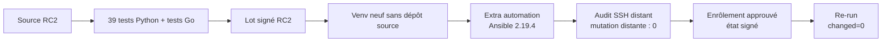

# Preuve d'adoption de `v1.0.0-rc.2`

> Preuve produite le 2026-07-12 dans `lab-console` et
> `lab-console-recovery`. La candidate a été construite et signée avec une clé
> synthétique dans le LAB, puis installée depuis son seul lot sur la console
> revenue à Debian `clean`. Aucun composant n'a été exécuté sur le laptop.

## Ce que RC2 corrige

L'essai RC1 avait montré qu'un utilisateur pouvait installer la console en
lecture seule, mais pas ses dépendances Ansible sans récupérer un fichier dans
le dépôt source. RC2 ajoute au wheel un extra `automation` entièrement épinglé
et documente l'origine nécessaire du premier accès SSH.



## Construction et cohérence du lot

`tools/build-release` exécute désormais les tests Python avant les tests Go. Il
refuse aussi un daemon, un coordinateur ou un wheel dont la version interne ne
correspond pas au nom demandé. Le build final a produit :

```text
Ran 39 tests in 3.595s
OK
tests Go : OK
Signature Verified Successfully
Release candidate 1.0.0-rc.2 construite et vérifiée
```

| Artefact | SHA-256 |
|---|---|
| console wheel | `199802bf324fc781910e1801ba9710a0f552fcc08cb5d855b48778b93f11f2c0` |
| engine Ansible | `4b3003f6f0802f1c5a778c5262ab4df61826dcda29c26a8f48b72c49a6708dad` |
| coordinateur amd64 | `989d6670479335badfbeba555f9b3f3d7db1575e3e7197a5bf0427469c2788de` |
| observer amd64 | `6dc78fb3e4d14c10644795ff2c5e4c98db675ba90ebb01deb586968a2baa2074` |

## Installation depuis le seul lot

La console neuve a revérifié la signature et toutes les sommes, puis cette
installation a résolu uniquement les versions portées par le wheel :

```text
pip install './your_cloud_console-1.0.0rc2-py3-none-any.whl[automation]'
Successfully installed ... ansible-core-2.19.4 ... your-cloud-console-1.0.0rc2
ansible-playbook [core 2.19.4]
```

Aucun fichier du dépôt source n'a été nécessaire sur cette console.

## Parcours distant complet

L'état P6 de `lab-machine-2` a d'abord été conservé dans le snapshot
`pre-rc2-adoption`, puis la VM est revenue à son snapshot Debian `clean`. Une
nouvelle clé d'opérateur synthétique a été créée dans la console RC2 ; seule sa
partie publique a été provisionnée sur la cible par le chemin LAB. Aucune clé
privée du contrôleur `labctl` n'a été copiée dans une VM.

Une déclaration et l'infrastructure `homelab` ont été créées depuis la seule
CLI installée. L'audit distant a confirmé Debian 13 amd64, systemd, l'accès
privilégié, l'espace disque, les sources de configuration et les sockets. La
décision vaut `eligible`, sans refus ni conflit, avec
`Mutation distante : 0`. La clé d'hôte a été enregistrée comme
`tofu-visible`. Un écart d'horloge de LAB a été rendu visible comme limite sans
être masqué.

La première commande `machine enroll` sans `--approve` a affiché le plan et
s'est terminée par `Plan non appliqué`. La seconde a exécuté le
`--syntax-check`, installé le daemon RC2 et vérifié son identité Ed25519 ainsi
que son premier état signé. `machine inspect` a ensuite rendu
`signature-ed25519-verified` et la version `1.0.0-rc.2`.

Le lot reconstruit après la revue documentaire affiche désormais le
récapitulatif Ansible au lieu de le masquer. Son re-run final a produit :

```text
Enrôlement vérifié : ... état signé séquence 3.
Ansible : 192.168.243.158 : ok=10 changed=0 unreachable=0 failed=0
```

## Relecture comme utilisateur junior

Un sous-agent temporaire a reçu le rôle d'un homelabber junior et l'interdiction
de lire le code, Git, les ADR, les preuves LAB ou Internet. Sa première lecture
de `README.md` et `INSTALLATION.md` s'est arrêtée après l'audit : origine du
lot, activation du venv, droits SSH, chemins d'artefacts et commande
d'enrôlement restaient trop implicites.

Après correction, il a estimé pouvoir suivre seul l'installation privée,
l'audit, le plan, l'enrôlement, l'inspection et le re-run. Sa seconde lecture a
encore demandé l'explication de `ssh.service`, du premier état sans
coordinateur, des variables à restaurer dans un nouveau terminal et des refus
courants. Ces points ont été ajoutés au guide avant le build final.

## Frontière de publication

RC2 est installable et son parcours minimal est prouvé depuis le seul lot. Elle
reste une candidate LAB signée par une clé synthétique : l'adoption autonome
publique attend encore un commit de référence, une signature de publication
dont l'empreinte est distribuée indépendamment et la pré-release GitHub. Elle
n'est pas encore `v1.0.0`.
