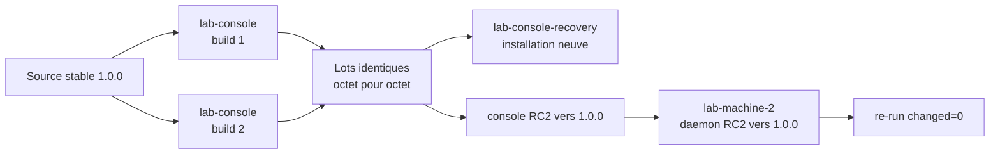

# Preuve finale du lot stable `1.0.0`

> Preuve menée le 2026-07-12 dans `lab-console`,
> `lab-console-recovery` et `lab-machine-2`. Aucun tag ni release GitHub n'a
> été créé : ils restent soumis au GO explicite sur le commit final.

## Placement de la preuve



Les trois machines sont issues de la topologie `v1-full`, portent l'origine
`your-cloud/labctl` et utilisent des adresses LAB distinctes des adresses
interdites. La signature emploie uniquement une clé synthétique créée dans
`lab-console`.

## Tests, build et reproductibilité

`tools/build-release` a été exécuté deux fois depuis la même source stable,
dans deux répertoires absents au départ. Chaque exécution a donné :

```text
Ran 39 tests ... OK
tests Go : OK
Signature Verified Successfully
Release stable 1.0.0 construite et vérifiée
```

`diff -qr` entre les deux lots n'a produit aucune sortie : tous les artefacts,
les métadonnées, les sommes, la clé publique et la signature sont identiques.

| Artefact | SHA-256 |
|---|---|
| `RELEASE-METADATA.json` | `7eb9b9e0c5274c12a85f7a12bebecede741366d1ceee62a6ca3b2b22b5ad20ee` |
| console wheel | `448b414be387eb034b49c309b24e40512c492cbe3ef2d7bf38d88f3552a6c2ee` |
| engine Ansible | `fe3fba964cde886a69503d1d5b09aa71ffccd14c0a106319544c1dfd9499a98f` |
| coordinateur amd64 | `aeaa8d11814831d5a7bcc24634f474b547f52c3681d188677ea9f92ee3cf59f9` |
| observer amd64 | `351c363599b110ccbddd3f55726fd643f5f72e615782e38110bd8f02db722c8c` |

## Installation neuve depuis le lot

Sur `lab-console-recovery`, la signature et toutes les sommes ont d'abord été
revérifiées. Un venv neuf a ensuite installé directement le wheel avec l'extra
`automation`, sans dépôt source :

```text
Successfully installed ... ansible-core-2.19.4 ... your-cloud-console-1.0.0
console : 1.0.0
ansible-playbook [core 2.19.4]
observer : 1.0.0
coordinateur : 1.0.0
```

## Mise à niveau depuis RC2

L'environnement de console utilisé pour l'adoption RC2 annonçait d'abord
`1.0.0rc2`. L'installation du wheel stable l'a remplacé proprement par
`1.0.0` avec les mêmes dépendances épinglées.

La cible `mini-pc`, portée par `lab-machine-2`, publiait un état signé par le
daemon `1.0.0-rc.2`. Le plan stable a conservé son identité
`6bea73dadb5b890319c809364235bcd496ba7dbd0d215746f525ee5d10f89a6e`,
installé le daemon `1.0.0`, puis la console a vérifié un nouvel état avec la
provenance `signature-ed25519-verified`.

Le premier passage de mise à niveau a produit `changed=2`. Le re-run immédiat
a confirmé l'idempotence :

```text
ok=10 changed=0 unreachable=0 failed=0 skipped=0 rescued=0 ignored=0
```

## Limites et décision

L'horloge de la cible LAB est décalée : la console affiche donc honnêtement
l'état comme `delayed`. La version, l'identité et la signature restent valides ;
la preuve ne transforme pas ce retard en diagnostic de panne.

Le lot stable est installable, reproductible et compatible avec le passage
depuis RC2. La clé de cette preuve reste synthétique : elle démontre le
mécanisme de signature, pas une identité publique durable. Le commit final peut
être proposé pour `v1.0.0`, mais le tag et la release exigent encore le GO exact
et, en cas de publication publique, une empreinte distribuée indépendamment.
